# Transentia

> 트랜잭션을 넘어, 자금의 흐름을 인식하고 판단하는 시스템.

송금 도메인에서 한 발 들어가 본 사이드 프로젝트예요.
처음엔 "송금 API 하나" 였는데, 풀어보니까 정합성·실시간성·운영성 세 자리가 같이 안 풀린다는 게 단계마다 자꾸 걸렸습니다.
그래서 phase 를 잘라서, 각 phase 마다 한 가지에만 손을 댔어요.

- **Phase 1 — 정합성**: 송금 트랜잭션과 Kafka 발행이 따로 노는 자리. Transactional Outbox + Polling Relay 로 묶었습니다.
- **Phase 2 — 운영성**: traceId 가 `@Async` 와 Kafka 경계에서 끊기는 자리. Micrometer Observation + ELK 로 traceId 한 줄을 따라가게 했어요.
- **Phase 3 — 실시간성**: 룰만으로는 "10분간 5건" 같은 시간 패턴이 안 잡히는 자리. Kafka Streams 윈도우 집계로 보강했습니다.

각 phase 의 "왜" 는 ADR, 실측은 실험 디렉터리, 사후 회고는 phase 별 문서에 분리해 적어뒀어요.

## 시스템 한 장으로 보기

<p align="center">
  
</p>

다이어그램이 여러 장이라 한 표에 모았어요.

| 다이어그램 | SVG | 소스 |
|---|---|---|
| System Context | [01-system-context.svg](docs/diagrams/svg/01-system-context.svg) | [.mmd](docs/diagrams/src/01-system-context.mmd) |
| 데이터 흐름 | [02-data-flow.svg](docs/diagrams/svg/02-data-flow.svg) | [.mmd](docs/diagrams/src/02-data-flow.mmd) |
| 헥사고날 계층 | [03-hexagonal-layers.svg](docs/diagrams/svg/03-hexagonal-layers.svg) | [.mmd](docs/diagrams/src/03-hexagonal-layers.mmd) |
| 분산 트레이싱 시퀀스 | [04-distributed-tracing.svg](docs/diagrams/svg/04-distributed-tracing.svg) | [.mmd](docs/diagrams/src/04-distributed-tracing.mmd) |
| Outbox 파티셔닝 Before/After | [05-outbox-partitioning.svg](docs/diagrams/svg/05-outbox-partitioning.svg) | [.mmd](docs/diagrams/src/05-outbox-partitioning.mmd) |

상세 설명은 [`docs/etc/system-architecture.md`](docs/etc/system-architecture.md) 에 같이 적었어요.

## Phase 1 — Outbox + 파티셔닝 (정합성)

<p align="center">
  
</p>

`@Transactional` 안에서 Kafka 를 직접 호출하면 커밋 후 발행 실패 시 이벤트가 유실돼요.
2PC 는 인프라 부담이 크고, Debezium 은 그 시점 우리한테 너무 큰 도구였습니다.
그래서 `transfer_events` 테이블에 outbox row 만 적재하고, 별도 Relay 가 `FOR UPDATE SKIP LOCKED` 로 폴링하는 방식으로 갔어요.

Relay 1대가 처리하다가 부하가 늘어서 3대로 늘렸는데, 거기서 한 자리 흔들렸습니다.
3대가 같은 쿼리를 던지니까 `SKIP LOCKED` 가 락 충돌은 막아줘도 빈 배치 폴링이 폭주했어요.
실측에서 Instance 2가 1,658회 빈 배치 조회를 한 게 잡혔고, 분배도 30/30/20으로 갈렸습니다.
`MOD(event_id, 3) = instance_id` 로 파티셔닝하니까 쿼리 수 1,673회 → 17회 (99% 감소), 분배 33.3/33.3/33.3 으로 정리됐어요.

| 지표 | Before | After |
|---|---|---|
| DB 쿼리 | 1,673회 | 17회 |
| 분배 | 30/30/20 | 33.3/33.3/33.3 |
| TPS | 470 | 1,410 |

근거: [E1 실험 패키지](docs/experiments/E1-outbox-partitioning/) · [ADR-002](docs/adr/ADR-002-transactional-outbox-pattern.md) · [ADR-003](docs/adr/ADR-003-relay-partitioning-by-modulo.md) · [회고](docs/retrospective/phase-1-outbox-and-partitioning.md)

## Phase 2 — 관측성과 캐시 (운영성)

Phase 1 끝나고 보니까 송금이 동작은 하는데 무엇이 일어났는지 모르겠더라고요.
`@TransactionalEventListener(phase=AFTER_COMMIT)` 가 새 스레드에서 실행되면서 traceId 가 사라지고, Kafka 컨슈머에서 또 새 trace 가 시작되는 흐름이었어요.

`ContextPropagatingTaskDecorator` 로 `@Async` 스레드의 컨텍스트를 옮기고, Kafka Streams 의 `TracingTransformer` 로 헤더의 `traceparent` 를 다시 MDC 로 끌어와서 traceId 한 줄로 transfer → Kafka → FDS 가 이어지게 했습니다.
로그도 stdout 만 봐선 cross-service 검색이 안 되니까 logback JSON 출력 → Filebeat → Elasticsearch 로 보내고, Tomcat AccessLog 도 별도 인덱스(`access-logs-*`)로 분리했어요.

그리고 부끄러운 자리 하나 — `TransferValidator` 의 일일 한도 검증이 약 1개월간 주석 처리된 채 비활성화돼 있었어요.
"DB SUM 쿼리 쓰기 싫고 Redis 도입은 미루고" 하는 사이에 비즈니스 룰이 작동을 안 하고 있었던 거예요.
이번에 `DailyTransferAmountCachePort` + `RedisDailyTransferAmountCacheAdapter` (`INCRBY` + TTL 26h) 로 정리했습니다.

근거: [ADR-005](docs/adr/ADR-005-redis-daily-limit-cache.md) · [ADR-006](docs/adr/ADR-006-elk-observability.md) · [ADR-007](docs/adr/ADR-007-distributed-tracing-context-propagation.md) · [회고](docs/retrospective/phase-2-observability-and-cache.md)

## Phase 3 — 스트림 처리와 FDS (실시간성)

룰 기반 단일 거래 탐지는 빠른데 "10분간 5건 송금" 같은 시간 패턴은 못 잡아요.
Kafka Streams 의 듀얼 파이프라인으로 풀었습니다.

- `processTransferEvents` — stateless. 매 송금마다 즉시 룰 평가 (HIGH_AMOUNT / SINGLE_HIGH_AMOUNT / RAPID_TRANSFER).
- `detectSuspiciousPatterns` — 10분 `windowedBy` 로 분산송금 / 자금세탁 패턴 탐지.

분석 결과는 `fraud_detections`, 의심 패턴 알림은 `suspicious_pattern_alerts` 에 적재합니다.

근거: [ADR-004](docs/adr/ADR-004-kafka-streams-for-pattern-detection.md) · [회고](docs/retrospective/phase-3-streaming-and-fds.md)

## Phase 4 — ML anomaly score 점진적 도입

<p align="center">
  
</p>

`AiScoreProvider` 포트만 두고 한동안 `NoOpAiScoreProvider` 가 자리를 차지하고 있었어요.
fraud 라벨 데이터가 0 인 상태에서 외부 ML SaaS 를 부르거나 자체 모델을 학습시키는 건 사이드 프로젝트 규모를 한참 넘는 일이라, 4단계로 점진적으로 들이기로 했습니다.

- **Phase 0 (NoOp)** — `aiScore=null`. `RiskLog` 에 자리만 있고 채워지지 않음.
- **Phase 1 (Heuristic)** — `HeuristicAiScoreAdapter`. 금액(log scale) + 시간(02~05 KST 새벽) + 속도(최근 5분 송금) 세 휴리스틱 가중합 → sigmoid → 0~1. 가중치는 사람 직관이고 학습은 0이에요. ML 이라기보다 룰 엔진의 확장에 가까운데, "PoC 1단계" 라는 명명으로 다음 어댑터 자리를 만들었습니다.
- **Phase 2 (Statistical)** — `StatisticalAiScoreAdapter`. 사용자별 30일 롤링 `ln(amount)` 평균/표준편차로 `|z-score|` 계산. cold start (N<5) 는 0.0 반환. `application.yml` 의 `fds.ai.score-provider=statistical` 로 교체 가능.
- **Phase 3 (Isolation Forest, 가설)** — Smile 라이브러리로 인-프로세스 ML. 학습 데이터 + 주기적 재학습 필요.
- **Phase 4 (ES dense_vector kNN, 가설)** — 외부 임베딩 모델 + Elasticsearch `knn search`. 거의 실시간 유사 거래 검색.

지금 운영되는 건 Phase 1 이에요. 가중치 0.4 / 0.25 / 0.1 / 0.2 / 0.3 / 0.15 가 모두 내 직관이라 부끄럽긴 한데, 라벨 없이는 어차피 정밀도 측정이 불가능해서 일단 분포 메트릭 (`fds.ai.score` p50/p95/p99) 만 노출해 두고 다음 라운드를 기다리는 자리예요.

근거: [ADR-011](docs/adr/ADR-011-ml-anomaly-score-evolution.md) · [회고](docs/retrospective/phase-4-ml-evolution.md) · [E6 실험 (NOT YET RUN)](docs/experiments/E6-ai-score-evolution/) · [PoC 설계](docs/etc/ml-anomaly-detection-poc.md)

## 트래픽 진화 — Outbox 가 영구 정답은 아니에요

지금 구현은 < 1K TPS 가정에 맞췄어요.
트래픽이 1K → 5K → 30K → 100K 로 갈 때 같은 Outbox + Polling 을 그대로 쓰면 DB 가 폴링 부하로 무너집니다.
어느 시점에 무엇으로 갈지 미리 결정 매트릭스로 박아뒀어요.

```
Phase 1 (Outbox)   ─►  Phase 2 (튜닝)  ─►  Phase 3 (CDC)
≤ 1K TPS               1K~5K               5K~30K
                                              │
                                              ▼
                                       Phase 4 (Tx Producer)
                                       30K~100K
                                              │
                                              ▼
                                       Phase 5 (Event Sourcing)
                                       100K+
```

전환 트리거는 메트릭으로 박혀 있어요.
`outbox_oldest_pending_seconds` p95 > 5s 이면 Phase 2 튜닝, p99 > 30s 이면 Phase 3 CDC 검토 — Prometheus alert 가 그 시점에 알림을 띄웁니다.
[`docs/EVOLUTION-ROADMAP.md`](docs/EVOLUTION-ROADMAP.md) 에 단계별 SVG 와 운영 체크리스트가 같이 있어요.

근거: [ADR-010](docs/adr/ADR-010-async-event-publishing-evolution.md) · [E5 CDC vs Outbox (NOT YET RUN)](docs/experiments/E5-cdc-vs-outbox/)

## 운영 측면

회복탄력성 / 모니터링 / 멀티 인스턴스 엣지케이스는 별도로 묶었어요.

- [`docs/FAILURE-MODES.md`](docs/FAILURE-MODES.md) — 컴포넌트별 장애 시 무엇이 멈추고 자동 회복되는지 / 사람이 와야 하는지.
- [`docs/MULTI-INSTANCE.md`](docs/MULTI-INSTANCE.md) — Snowflake node_id 충돌, Outbox MOD 인스턴스 수 불일치, Kafka Streams `instance.id` 등.
- [`docs/LIMITATIONS.md`](docs/LIMITATIONS.md) — 운영 검증 부재 영역 (정직히 적었어요).
- [`monitoring/prometheus-alerts.yml`](monitoring/prometheus-alerts.yml) — 14 개 alert + Phase 전환 트리거.
- [`monitoring/grafana/provisioning/dashboards/transentia.json`](monitoring/grafana/provisioning/dashboards/transentia.json) — Outbox lag, Redis CB, FDS latency 등 12 패널.

회복탄력성은 코드 측면에선 Redis 어댑터에 Resilience4j Circuit Breaker + Retry + Fallback 을 적용했어요.
다만 Toxiproxy 로 실제 장애를 주입해 본 적은 없어서, [E3 실험](docs/experiments/E3-circuit-breaker/) 은 NOT YET RUN 으로 명시하고 후속 PR 로 미뤄뒀습니다.

## 모듈 구조

```
back-end/
├── build-logic/                 # Gradle convention plugins
├── common/{common-domain, common-application}
├── infrastructure/kafka/        # producer/consumer/config/model
├── services/
│   ├── transfer/
│   │   ├── domain/              # Transaction, User, AccountBalance, Validator
│   │   ├── application/         # TransactionService, 포트 정의
│   │   ├── infra/               # JPA, Redis, Kafka producer 어댑터
│   │   └── instances/{api, transfer-relay}
│   └── fds/
│       ├── domain/              # RiskLog, FraudRule, TransferCompleteEvent
│       ├── application/         # AnalyzeTransferService, 포트 정의
│       ├── infra/               # Kafka Streams, JPA 어댑터
│       └── instances/api/
├── monitoring/                  # filebeat.yml, prometheus.yml, grafana/
├── load-test/                   # k6 시나리오
└── docs/
    ├── adr/                     # Architecture Decision Records (10건)
    ├── retrospective/           # Phase 별 회고
    ├── experiments/             # 실험 패키지 (DESIGN/RESULTS/RETRO)
    ├── load-test/               # 부하 테스트 분석
    ├── diagrams/                # mermaid 소스 + SVG
    └── etc/                     # 기술 블로그/메모
```

## 실행

```bash
# 인프라 + API 전부
docker compose up -d

# 또는 개별
docker compose up -d postgres kafka schema-registry init-topics redis elasticsearch kibana filebeat
./gradlew :transfer-api:bootRun
./gradlew :fds-api:bootRun
./gradlew :transfer-relay:bootRun     # 선택

# 부하 테스트
k6 run load-test/vus-100.js
```

## 기술 스택

Kotlin + Java 21 / Spring Boot 3.x / Spring Cloud Stream / Spring Kafka / Spring Batch / Resilience4j /
PostgreSQL 15 / Redis 7 / Apache Kafka 3.9 (Avro + Schema Registry) /
Micrometer Observation / Prometheus / Grafana / ELK 8.x /
Gradle 8 + Kotlin DSL + Convention Plugins / JUnit5 + Testcontainers + k6.

## 남은 작업

- `AiScoreProvider` 실 어댑터 (ES `dense_vector` kNN).
- WebSocket / Slack 알림 어댑터.
- DLQ Worker.
- Phase 3 (CDC) PoC. 전환 트리거는 [`docs/EVOLUTION-ROADMAP.md`](docs/EVOLUTION-ROADMAP.md) 참조.
- chaos testing (Toxiproxy 로 E3 실측).

## 문서 인덱스

- 결정 — [ADR](docs/adr/README.md)
- 실험 — [Experiments](docs/experiments/README.md)
- 회고 — [Retrospective](docs/retrospective/README.md)
- 시간 축 — [DECISIONS-TIMELINE](docs/DECISIONS-TIMELINE.md)
- 운영 — [FAILURE-MODES](docs/FAILURE-MODES.md) · [MULTI-INSTANCE](docs/MULTI-INSTANCE.md) · [LIMITATIONS](docs/LIMITATIONS.md)
- 진화 — [EVOLUTION-ROADMAP](docs/EVOLUTION-ROADMAP.md)
- 부하 — [load-test](docs/load-test/README.md)
- 메모 — [docs/etc/](docs/etc/)

## 라이선스

MIT.
