# EVOLUTION-ROADMAP — 트래픽 진화에 따른 시스템 단계

> 현재 시스템은 **Phase 1** (Outbox + Polling) 까지 구현. 이후 단계는 가설 + 전환 트리거 메트릭.
> ADR-010 이 결정 근거. 이 문서는 **운영 입장에서 어느 시점에 무엇을 하느냐** 의 가이드.

## 한 줄 요약

```
Phase 1 (Outbox)     ───────► Phase 2 (튜닝)    ───────► Phase 3 (CDC)
  ≤ 1K TPS                       1K~5K TPS                  5K~30K TPS
                                                            │
                                                            ▼
                                                       Phase 4 (Tx Producer)
                                                       30K~100K TPS
                                                            │
                                                            ▼
                                                       Phase 5 (Event Sourcing)
                                                       100K+ TPS
```

각 화살표가 곧 **명시적 결정 지점**. 트리거 메트릭이 해당 임계 초과 시 다음 phase 의 ADR 작성.

---

## Phase 1 — Outbox + Polling Relay (현재)

### 구성

- `transactions` (송금 본체) + `transfer_events` (Outbox) → 같은 트랜잭션.
- `transfer-relay` × 3 인스턴스 + `MOD(event_id, 3) = instance_id` + `FOR UPDATE SKIP LOCKED`.
- Spring Batch chunk 처리.

### 성능 (E1 실측)

- 10,000건 / 3 인스턴스 / 20,690ms ≈ **483 TPS** (relay 발행 처리량).
- DB 쿼리 17회 (vs 단순 SKIP LOCKED 의 1,673회).
- 분배 33.3% ± 0.0%.

### 트래픽 천장

- 추정: 1K TPS 까지 안정.
- 한계 요인:
  - DB 폴링 부하 (1초 간격 기준 매초 N 인스턴스 × 1 쿼리).
  - 폴링 간격이 곧 lag 하한 (1초 = lag 최소 0~1초).

### 운영 메트릭

- `outbox_pending_count` (게이지)
- `outbox_oldest_pending_seconds` (게이지)
- HikariCP `connection.usage`

### 다음 Phase 로 전환 트리거

- `outbox_pending_count` p95 > **500** sustained 1h **OR**
- `outbox_oldest_pending_seconds` p95 > **5s**

---

## Phase 2 — Polling 튜닝 (1K ~ 5K TPS, 가설)

### 변경 사항

| 파라미터 | Phase 1 | Phase 2 |
|---|---|---|
| 배치 사이즈 | 1,000 | 5,000~10,000 |
| 폴링 간격 | 1,000ms | 200ms |
| Relay 인스턴스 수 | 3 | 5~7 |
| MOD partition_count | 3 | 5~7 |
| HikariCP max | 10 | 20 |
| Kafka batch.size | 16384 | 65536 (현재 적용됨) |
| Kafka linger.ms | 5 (현재) | 10~20 (배치 효율 ↑) |

### 비용 vs 이득

- 비용: DB CPU +15~20%, 빈 배치 폴링 증가.
- 이득: TPS 한계 약 5배 (1K → 5K 추정).
- ROI: 작업량 1주 수준. **튜닝만으로 가성비 최고**.

### 위험

- 인스턴스 수 변경 시 `partition_count` 도 동시 변경 — [`MULTI-INSTANCE.md` § 2](MULTI-INSTANCE.md#2-outbox-mod-파티셔닝의-인스턴스-수-불일치) 의 race 위험.
- 배치 사이즈 ↑ 시 DB 트랜잭션 시간 ↑ → 다른 트랜잭션의 락 대기 증가.

### 전환 트리거 (Phase 2 → Phase 3)

- 폴링 간격을 100ms 까지 줄여도 lag 안 잡힘 **OR**
- DB CPU 의 30% 이상이 outbox 폴링 차지 **OR**
- `outbox_oldest_pending_seconds` p99 > **30s**

---

## Phase 3 — CDC (Debezium PostgreSQL Connector, 5K ~ 30K TPS, 가설)

### 구성

```
PostgreSQL WAL ──► Debezium Connector ──► Kafka Connect ──► Kafka Topic
                                                              │
                                                              ▼
                                                    기존 컨슈머 (FDS 등)
```

- Outbox 테이블은 유지하되 **Polling 제거**. 또는 outbox 도 제거하고 `transactions` 테이블의 변경을 직접 CDC.
- `pgoutput` plugin + `replication slot`.
- Kafka Connect 클러스터 별도 운영.

### 비용

- **인프라**: Kafka Connect (별도 JVM 클러스터, 최소 3 노드 권장).
- **운영**:
  - logical replication slot 모니터링 (lag 시 WAL 디스크 폭증).
  - schema history topic 관리.
  - PostgreSQL `wal_level=logical` 변경 → 약간의 throughput 손실.
- **개발**:
  - 메시지 포맷 변경 (`Envelope { before, after }`).
  - 모든 컨슈머의 deserializer 변경.
  - schema evolution 규칙 합의.

### 이득

- Polling 비용 0 → DB CPU 대폭 절감.
- p99 latency: 1~2초 → **100~500ms** (WAL flush 주기 의존).
- 다양한 도구 활용 (Debezium UI, Connect REST).

### 위험

- **replication slot 의 영구 갈증**: 컨슈머가 죽어도 slot 은 살아있어 WAL 누적. 디스크 풀.
- Schema Registry 와 Debezium 의 schema 일관성.
- Debezium snapshot 단계 (초기 전체 스캔) 의 DB 부하.

### 전환 트리거 (Phase 3 → Phase 4)

- p99 latency < 100ms 비즈니스 요구 **OR**
- Outbox 적재 자체가 비즈니스 적인 부담 **OR**
- DB write 의 30% 이상이 outbox row 차지

---

## Phase 4 — Kafka Transactional Producer (30K ~ 100K TPS, 가설)

### 구성

```kotlin
@Transactional
fun createTransfer(...) {
    // DB write
    transactionRepository.save(...)

    // 같은 Kafka transaction 안에서 produce
    kafkaTemplate.send(...)  // Kafka Tx 자동 부착
}
```

- Outbox 테이블 **완전 제거**.
- DB와 Kafka 의 분산 트랜잭션 (정확한 의미의 2PC 는 아님 — best-effort).

### 비용

- 컨슈머는 `isolation.level=read_committed` 강제 — lag 증가.
- Transactional producer 의 commit overhead (~5~10ms per tx).
- Kafka Streams 의 `processing.guarantee=exactly_once_v2` 필요.
- DB ↔ Kafka 의 일관성 추론 어려움 (예: DB commit 성공, Kafka 실패 시).

### 이득

- Outbox 테이블 제거 → DB write 부담 절감.
- 폴링/CDC 인프라 모두 제거.
- 토폴로지 단순화.

### 위험

- 분산 트랜잭션의 본질적 어려움 — exactly-once 는 함정.
- 큰 시스템에선 거의 안 씀 (LinkedIn Kafka 팀도 신중).

---

## Phase 5 — Event Sourcing (100K+ TPS, 가설)

### 패러다임

- DB 가 곧 Event Store. `transactions` 테이블이 사라지고 `transfer_events` 만 남음.
- 잔액/잔고 같은 read model 은 별도 projection.

### 비용

- 모든 도메인 코드 재작성.
- read model 빌드/갱신 인프라.
- Eventual consistency — 비즈니스 로직 재설계.

### 이득

- 진정한 분산 — 100K+ TPS.
- 감사/규제 대응 우수 (모든 변경이 이벤트로 기록).
- 시간 여행 쿼리.

### 트리거

- 100K+ TPS **AND** 감사 요구 강함 **AND** 다중 read model 필요.
- 빅테크 핀테크 (예: Stripe, Square) 의 핵심 트랜잭션 시스템 수준.

---

## 운영 체크리스트 (각 전환 직전)

### Phase 1 → 2 체크리스트

- [ ] `outbox_pending_count` p95 추세 분석 (1주 이상).
- [ ] DB CPU 사용량 중 outbox 폴링 비중 측정 (`pg_stat_activity` + `pg_stat_statements`).
- [ ] 인스턴스 / partition_count 동시 변경 배포 절차 정의 ([MULTI-INSTANCE § 2](MULTI-INSTANCE.md#2-outbox-mod-파티셔닝의-인스턴스-수-불일치)).
- [ ] 롤백 절차 — 이전 파라미터로 1줄 PR.

### Phase 2 → 3 체크리스트

- [ ] Debezium PoC 실험 ([E5 (예정)](experiments/) 가 이 작업의 입력).
- [ ] Kafka Connect 클러스터 운영 인력 확보.
- [ ] 컨슈머 deserializer 의 Envelope 포맷 대응 (Avro + Debezium schema).
- [ ] replication slot 모니터링 alert (`pg_replication_slots.confirmed_flush_lsn` lag).
- [ ] 점진적 전환 — 한 토픽씩 CDC 로 마이그레이션.

### Phase 3 → 4 체크리스트

- [ ] 컨슈머 isolation.level read_committed 의 lag 측정.
- [ ] `processing.guarantee=exactly_once_v2` 의 throughput 영향 측정.
- [ ] DB ↔ Kafka 비일관성 시나리오 chaos 테스트.

### Phase 4 → 5 체크리스트

- [ ] 도메인 재모델링 사전 작업 (Domain Events, Aggregate root).
- [ ] read model 갱신 latency vs 비즈니스 SLO.
- [ ] 6개월~1년 마이그레이션 계획.

---

## 다이어그램

<p align="center">
  
  <br/><em>Phase 1 — 현재 구현</em>
</p>

<p align="center">
  
  <br/><em>Phase 2 — Polling 튜닝 (1K~5K TPS)</em>
</p>

<p align="center">
  
  <br/><em>Phase 3 — CDC (Debezium, 5K~30K TPS)</em>
</p>

<p align="center">
  
  <br/><em>Phase 4 — Kafka Transactional Producer (30K~100K TPS)</em>
</p>

<p align="center">
  
  <br/><em>Phase 5 — Event Sourcing (100K+ TPS)</em>
</p>

## 관련 문서

- [ADR-010 비동기 발행 진화](adr/ADR-010-async-event-publishing-evolution.md) — 결정 근거
- [E1 Outbox 파티셔닝 실험](experiments/E1-outbox-partitioning/) — Phase 1 정당화
- E5 CDC vs Outbox (예정) — Phase 3 PoC 설계
- [LIMITATIONS](LIMITATIONS.md) — 운영 검증 부재 영역
- [MULTI-INSTANCE](MULTI-INSTANCE.md) — 스케일링 엣지케이스
- [FAILURE-MODES](FAILURE-MODES.md) — 각 컴포넌트 장애 영향도
