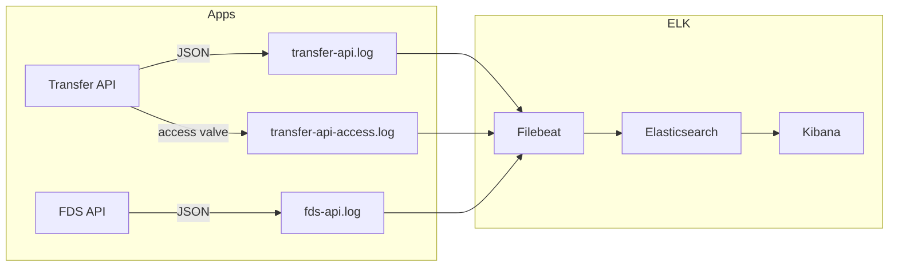

# ADR-006: ELK Stack 기반 관측성(Observability) 도입

- **Status**: Accepted
- **Date**: 2026-05-16
- **Deciders**: Backend Lead
- **Tags**: observability, logging, elk, filebeat, kibana, accesslog

---

## Context

ADR-007 (Distributed Tracing) 으로 `traceId` 가 전 구간에 흐르게 되었다. 그러나 **로그가 분산되어 있으면 traceId 가 있어도 검색이 안 된다.**

```
[Transfer API] 09:00:00.123 송금 요청 수신    (traceId: cc432...)
[FDS API]      09:00:00.456 사기 탐지 처리 중  (traceId: cc432...)
[Transfer API] 09:00:01.789 에러 발생!         (traceId: cc432...)
```

각 서비스의 로그 파일을 grep 으로 따로 뒤져서 traceId 를 모으는 것은 운영 환경에서 불가능에 가깝다.

### 직전 커밋 컨텍스트

- `d463d3a feat: ELK Stack 통합 - Filebeat 기반 로그 수집 및 Kibana 시각화`
- `3b37ee3 feat: 분산 트레이싱 컨텍스트 전파 구현` (ADR-007 의 산출물)

### 추가 요구사항: AccessLog 분리

송금 API 의 HTTP 접근 로그(액세스 로그) 는 애플리케이션 로그와 **포맷·인덱스·보존 기간** 이 달라야 한다.

- **AccessLog**: 요청-응답 메타데이터 (URL, status, duration). 트래픽 분석 용도. 90일 보존.
- **AppLog**: 애플리케이션 비즈니스 로그. 에러 디버깅. 30일 보존.

각 도메인에서 동일한 로그 수집기로 두 종류 로그를 별도 인덱스로 보내야 한다.

---

## Decision

**ELK Stack (Elasticsearch + Filebeat + Kibana) 을 채택한다. Logback JSON 출력 → 로컬 파일 → Filebeat → Elasticsearch 의 4단계 파이프라인을 구성한다. Filebeat 의 input 을 `app` / `access` 두 개로 분리하여 인덱스를 나눈다.**

### 1. 아키텍처



### 2. Filebeat 구성 (`monitoring/filebeat.yml`)

```yaml
filebeat.inputs:
  # App 로그 입력
  - type: log
    enabled: true
    paths:
      - /var/log/apps/*.log
    exclude_files: ['.*access.*\.log$']     # access 로그 제외
    json.keys_under_root: true
    json.add_error_key: true
    json.message_key: message
    fields:
      log_type: app
      environment: local
    fields_under_root: true

  # AccessLog 입력
  - type: log
    enabled: true
    paths:
      - /var/log/apps/*access*.log
    json.keys_under_root: true
    json.add_error_key: true
    fields:
      log_type: access
      environment: local
    fields_under_root: true

output.elasticsearch:
  hosts: ["elasticsearch:9200"]
  indices:
    - index: "access-logs-%{+yyyy.MM.dd}"
      when.equals:
        log_type: "access"
    - index: "app-logs-%{+yyyy.MM.dd}"
      when.equals:
        log_type: "app"

setup.template.name: "logs"
setup.template.pattern: "*-logs-*"
setup.ilm.enabled: false
```

### 3. AppLog: Logback JSON 출력

```xml
<appender name="JSON_FILE" class="ch.qos.logback.core.rolling.RollingFileAppender">
    <file>${LOG_PATH}/transfer-api.log</file>
    <encoder class="net.logstash.logback.encoder.LogstashEncoder">
        <includeMdcKeyName>traceId</includeMdcKeyName>
        <includeMdcKeyName>spanId</includeMdcKeyName>
        <customFields>{"app_name":"transfer-api"}</customFields>
    </encoder>
</appender>
```

### 4. AccessLog: Tomcat Valve 채택 (T1 의사결정)

`services/transfer/instances/api/src/main/resources/application.yml:1`

```yaml
server:
  tomcat:
    accesslog:
      enabled: true
      directory: ${LOG_PATH:/var/log/apps}
      prefix: transfer-api-access
      suffix: .log
      file-date-format: .yyyy-MM-dd
      pattern: '{"@timestamp":"%t{yyyy-MM-dd''T''HH:mm:ss.SSSXXX}","remote_ip":"%a","method":"%m","uri":"%U","query":"%q","status":%s,"bytes":%b,"duration_ms":%D,"user_agent":"%{User-Agent}i","referer":"%{Referer}i","app_name":"transfer-api"}'
      buffered: false
```

**왜 Tomcat Valve 인가 (T1):**

- Spring Servlet Filter 로 액세스 로그를 만들 수도 있지만 **DispatcherServlet 진입 전/후의 요청을 놓친다**. 정적 자원 / 404 요청 등.
- Tomcat AccessLogValve 는 **Servlet container 레벨에서 모든 요청을 캡처**. 503/connection reset 도 기록.
- `pattern` 을 JSON 으로 직접 작성해서 Filebeat 의 JSON parser 와 호환.

### 5. ECS 필드명 충돌 방지

처음에 `customFields = {"service":"transfer-api"}` 로 설정했더니 Filebeat ECS(Elastic Common Schema)의 `service` 필드(object 타입)와 충돌했다.

```
"reason": "object mapping for [service] tried to parse field [service] as object, but found a concrete value"
```

→ **`app_name` 으로 변경.** 운영자에게 “ECS 예약 필드명 피하기” 가이드 필요.

### 6. Docker Compose 구성

```yaml
elasticsearch:
  image: docker.elastic.co/elasticsearch/elasticsearch:8.11.0
  environment:
    - discovery.type=single-node
    - xpack.security.enabled=false               # 로컬 개발용
    - ES_JAVA_OPTS=-Xms512m -Xmx512m

kibana:
  image: docker.elastic.co/kibana/kibana:8.11.0
  depends_on:
    elasticsearch: { condition: service_healthy }

filebeat:
  image: docker.elastic.co/beats/filebeat:8.11.0
  user: root
  volumes:
    - ./monitoring/filebeat.yml:/usr/share/filebeat/filebeat.yml:ro
    - ./logs:/var/log/apps:ro
```

---

## Consequences

### Positive

- **traceId 기반 전 구간 검색**: Kibana Discover 에서 `traceId: "cc432cdd..."` 한 줄로 Transfer API + FDS API + Kafka Streams 의 로그가 묶인다.
- **로그 보관 자동화**: 일별 인덱스(`app-logs-yyyy.MM.dd`)로 자동 분리. ILM 없이도 인덱스 단위 삭제로 보존 정책 운영 가능.
- **AccessLog 분리**: 트래픽 분석은 `access-logs-*`, 디버깅은 `app-logs-*` 로 명확히 분리.
- **앱-수집기 분리**: 앱은 파일에만 쓰고 Filebeat 가 수집. **ES 장애 시 앱은 영향 없음**. Filebeat 가 backpressure 처리.
- **원본 파일 보존**: Filebeat 가 실패해도 로그 파일은 디스크에 남는다. 재처리 가능.
- **Kibana 시각화**: 송금 status 별 비율, traceId 별 응답 시간 histogram 등을 dashboard 로.

### Negative

- **인프라 컴포넌트 3개 추가**: Elasticsearch / Kibana / Filebeat. 메모리 점유 (`-Xms512m` 기준 ES 만 ~1.5GB).
- **디스크 사용량**: 로그가 로컬 파일 + ES 인덱스 두 번 저장된다. 디스크 모니터링 필수.
- **ES single-node 제약**: `xpack.security.enabled=false` 로 단일 노드 개발용. 운영 환경에서는 인증·TLS 활성화 필요.
- **ILM(Index Lifecycle Management) 미사용**: `setup.ilm.enabled: false` 로 단순화. 운영 환경에서는 ILM 으로 hot-warm-cold 분리 권장.
- **timestamp 필드 충돌 위험**: AccessLog 의 `@timestamp` 와 Filebeat 자동 추가 `@timestamp` 의 충돌 가능성. 현재는 Filebeat processor 에서 정렬:
  ```yaml
  processors:
    - timestamp:
        field: "@timestamp"
        layouts: ['2006-01-02T15:04:05.999Z07:00']
  ```

### Neutral

- **ELK vs OpenSearch**: AWS 환경 이전 시 OpenSearch 로 교체 가능 (호환성 큼). 본 ADR 은 ELK 로 시작.
- **Kibana Data View 수동 생성**: `app-logs-*`, `access-logs-*` 두 개의 Data View 를 운영자가 한 번 생성해야 함. 자동화 스크립트 미포함.

---

## Alternatives Considered

### A. Loki + Grafana

- **장점**:
  - 로그 인덱싱 비용 매우 낮음 (label 기반).
  - Prometheus + Grafana 가 이미 있다면 통합 자연스러움.
  - 디스크 사용량 ELK 대비 1/5 ~ 1/10.
- **단점**:
  - **Full-text 검색이 약함**. Loki 는 label 검색 + grep 컨셉. traceId 검색은 가능하지만 복잡한 쿼리는 어려움.
  - Kibana 의 시각화 풍부함 부족.
- **기각 사유**: traceId 풀스캔 검색이 핵심 유스케이스. Loki 의 label 모델로는 traceId 가 high-cardinality → label 부적합.

### B. AWS CloudWatch Logs

- **장점**:
  - Managed 운영. 운영 컴포넌트 0.
  - AWS 환경이면 ECS/Lambda 와 자동 통합.
- **단점**:
  - **로컬 개발 비호환** (또는 LocalStack 필요).
  - 비용이 traffic 비례로 빠르게 증가.
  - 쿼리 언어(CloudWatch Insights) 가 Kibana/ES 보다 빈약.
- **기각 사유**: 현재 AWS 미사용. AWS 이전 시 OpenSearch + Kibana 로 갈 가능성 높음.

### C. OpenSearch (ELK fork)

- **장점**: ELK 와 호환. 라이선스 무료(Apache 2.0).
- **단점**: 일부 기능(Anomaly Detection 등) Elastic 본가와 차이.
- **기각 사유**: 현재 단계에서는 본가 ELK 로 시작. AWS 이전 시 OpenSearch 로 자연스럽게 이관 가능.

### D. ES 직접 전송 (Logback Logstash Appender → TCP → ES)

```xml
<appender name="LOGSTASH" class="net.logstash.logback.appender.LogstashTcpSocketAppender">
    <destination>localhost:5000</destination>
</appender>
```

- **장점**: Filebeat 불필요. 설정 단순.
- **단점**:
  - **ES 장애 시 앱 블로킹/유실**. Logback 의 async appender 로 완화는 가능하지만 버퍼 한계.
  - 네트워크 순단 시 로그 유실.
  - 원본 파일 없음 → ES 손상 시 복구 불가.
- **기각 사유**: 금융 도메인에서 로그 유실 = 사고. Filebeat 의 “파일 우선 + 수집 분리” 가 안전.

---

## Trade-offs

| 축 | ELK + Filebeat (채택) | Loki + Grafana | CloudWatch | ES 직접 전송 |
|---|---|---|---|---|
| **검색 표현력** | 최상 (KQL/DSL) | 중 (label + LogQL) | 중 (Insights) | 최상 |
| **로그 유실 위험** | 낮음 (파일 보존) | 낮음 | 중 (네트워크 의존) | 높음 (앱 블로킹) |
| **디스크 사용량** | 높음 (인덱스 + 파일) | 낮음 | 외부 보관 | 낮음 (파일 없음) |
| **운영 컴포넌트** | 3개 (ES/Kibana/Filebeat) | 3개 (Loki/Grafana/Promtail) | 0 (managed) | 1개 (ES) |
| **AWS 호환** | OpenSearch 로 이관 가능 | Grafana Cloud | 네이티브 | OpenSearch |
| **traceId 검색** | 즉시 가능 | 가능 (느림) | 가능 | 즉시 |
| **로컬 개발** | Docker 로 즉시 | Docker | LocalStack 필요 | Docker |

---

## Operational Considerations

### 디스크 모니터링

- ES `disk.percent > 85%` 시 alert.
- Filebeat registry 파일(`/usr/share/filebeat/data`) 도 디스크 점유 확인.

### Kibana Data View 생성 절차

1. Kibana (http://localhost:5601) → Stack Management → Data Views.
2. Create data view:
   - Name: `app-logs-*` / Pattern: `app-logs-*` / Timestamp: `@timestamp`
   - Name: `access-logs-*` / Pattern: `access-logs-*` / Timestamp: `@timestamp`

### traceId 검색 예시

```text
traceId: "cc432cdd40430597f1660a25a99098cd"
```

전 구간 로그가 시간 순으로 정렬되어 표시된다.

### Filebeat 멈춤 감지

- Filebeat metrics endpoint(`http://filebeat:5066`) 또는 ES 인덱스의 최신 timestamp 갭으로 감지.

---

## References

### 코드 경로

- Filebeat 설정: `monitoring/filebeat.yml`
- Transfer API application.yml: `services/transfer/instances/api/src/main/resources/application.yml:1-10`
- FDS API application.yml: `services/fds/instances/api/src/main/resources/application.yml`
- Docker Compose ELK 섹션: `docker-compose.yml`
- Logback 설정: `services/transfer/instances/api/src/main/resources/logback-spring.xml`
- 상세 문서: `docs/etc/observability-setup - ELK_Stack.md`
- 액세스로그 멘토링 메모: `docs/todo/0104_멘토링/accessLog.md`

### 외부 자료

- Elastic Common Schema (ECS) Reference
- Logback Logstash Encoder, https://github.com/logfellow/logstash-logback-encoder
- Tomcat AccessLogValve documentation
- Apache Lucene / Elasticsearch documentation

---

## Related ADRs

- ADR-007: Distributed Tracing Context Propagation (traceId 가 본 ADR 의 핵심 검색 키)
- ADR-001: Hexagonal Architecture (Logback 설정은 instances 모듈 책임)
