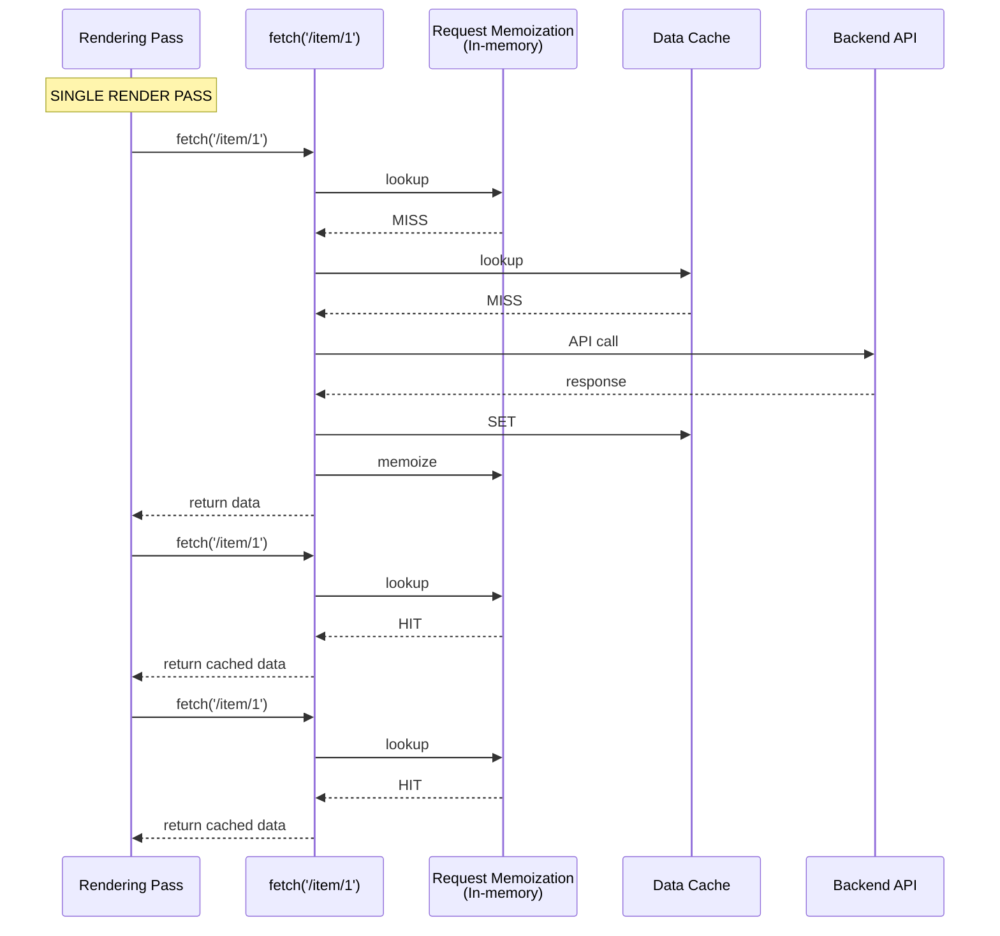
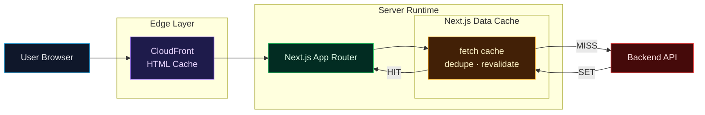
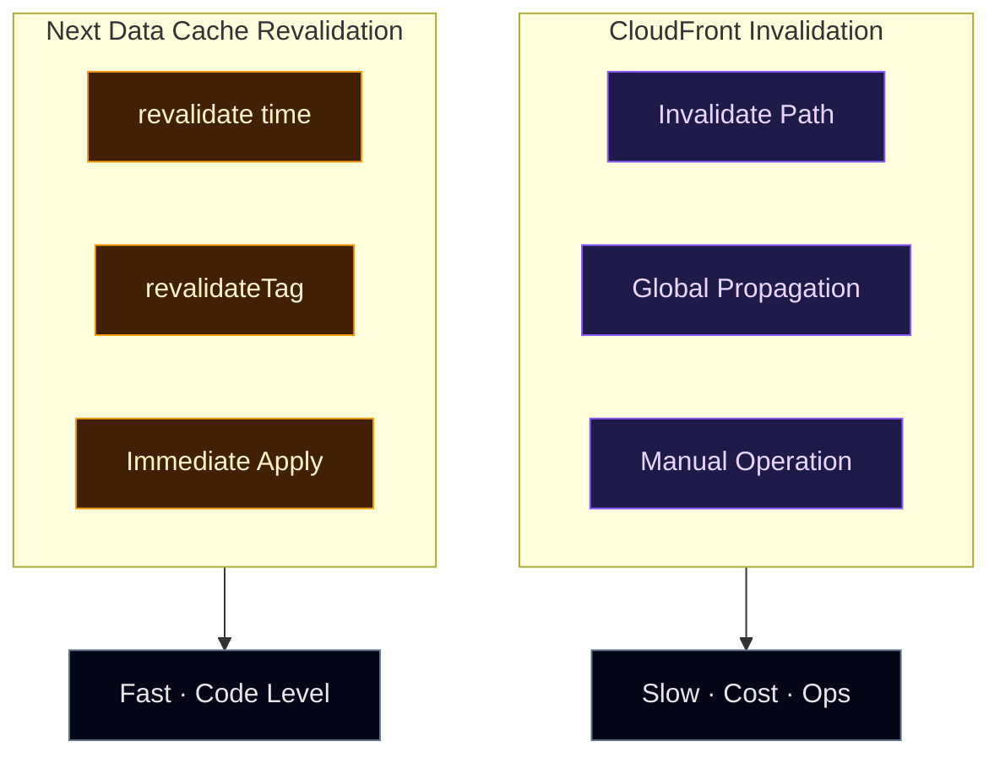

## http 와 https 동작 원리

## OSI 7Layer 레벨에서의 설명 방법 

```mermaid
sequenceDiagram
    participant R as Rendering Pass
    participant F as fetch('/item/1')
    participant M as Request Memoization<br/>(In-memory)
    participant C as Data Cache
    participant B as Backend API

    Note over R: SINGLE RENDER PASS

    R->>F: fetch('/item/1')
    F->>M: lookup
    M-->>F: MISS
    F->>C: lookup
    C-->>F: MISS
    F->>B: API call
    B-->>F: response
    F->>C: SET
    F->>M: memoize
    F-->>R: return data

    R->>F: fetch('/item/1')
    F->>M: lookup
    M-->>F: HIT
    F-->>R: return cached data

    R->>F: fetch('/item/1')
    F->>M: lookup
    M-->>F: HIT
    F-->>R: return cached data

```

```mermaid
sequenceDiagram
    participant R as Rendering Pass
    participant F as fetch('/item/1')
    participant M as Request Memoization<br/>(In-memory)
    participant C as Data Cache
    participant B as Backend API

    Note over R: SINGLE RENDER PASS

    R->>F: fetch('/item/1')
    F->>M: lookup
    M-->>F: MISS
    F->>C: lookup
    C-->>F: MISS
    F->>B: API call
    B-->>F: response
    F->>C: SET
    F->>M: memoize
    F-->>R: return data

    R->>F: fetch('/item/1')
    F->>M: lookup
    M-->>F: HIT
    F-->>R: return cached data

    R->>F: fetch('/item/1')
    F->>M: lookup
    M-->>F: HIT
    F-->>R: return cached data
```

```mermaid
flowchart LR
%% CLASS
    classDef client fill:#0f172a,color:#e5e7eb,stroke:#38bdf8
    classDef edge fill:#1e1b4b,color:#e9d5ff,stroke:#8b5cf6
    classDef server fill:#022c22,color:#dcfce7,stroke:#22c55e
    classDef cache fill:#422006,color:#fef3c7,stroke:#f59e0b
    classDef backend fill:#450a0a,color:#fee2e2,stroke:#ef4444

%% NODES
    U[User Browser]:::client

    subgraph EDGE["Edge Layer"]
        CF[CloudFront<br/>HTML Cache]:::edge
    end

subgraph SERVER["Server Runtime"]
AR[Next.js App Router]:::server

subgraph DC_LAYER["Next.js Data Cache"]
DC[fetch cache<br/>dedupe · revalidate]:::cache
end
end

BE[Backend API]:::backend

%% FLOW
U --> CF --> AR
AR --> DC
DC -->|MISS| BE
BE -->|SET| DC
DC -->|HIT| AR
```

```mermaid
flowchart TB
    classDef cf fill:#1e1b4b,color:#e9d5ff,stroke:#8b5cf6
    classDef dc fill:#422006,color:#fef3c7,stroke:#f59e0b
    classDef note fill:#020617,color:#e5e7eb,stroke:#64748b

    subgraph CF_INV["CloudFront Invalidation"]
        CF1[Invalidate Path]:::cf
        CF2[Global Propagation]:::cf
        CF3[Manual Operation]:::cf
    end

    subgraph DC_INV["Next Data Cache Revalidation"]
        DC1[revalidate time]:::dc
        DC2[revalidateTag]:::dc
        DC3[Immediate Apply]:::dc
    end

    CF_INV --> N1[Slow · Cost · Ops]:::note
    DC_INV --> N2[Fast · Code Level]:::note

```

```mermaid
flowchart TB
    classDef cf fill:#1e1b4b,color:#e9d5ff,stroke:#8b5cf6
    classDef dc fill:#422006,color:#fef3c7,stroke:#f59e0b
    classDef note fill:#020617,color:#e5e7eb,stroke:#64748b

    subgraph CF_INV["CloudFront Invalidation"]
        CF1[Invalidate Path]:::cf
        CF2[Global Propagation]:::cf
        CF3[Manual Operation]:::cf
    end

    subgraph DC_INV["Next Data Cache Revalidation"]
        DC1[revalidate time]:::dc
        DC2[revalidateTag]:::dc
        DC3[Immediate Apply]:::dc
    end

    CF_INV --> N1[Slow · Cost · Ops]:::note
    DC_INV --> N2[Fast · Code Level]:::note

```