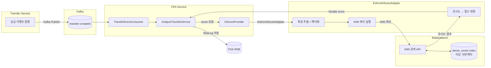

# ML 기반 이상행위 탐지 PoC 계획

## 1. 문제 정의 — 룰 기반 한계

현재 FDS는 `HIGH_AMOUNT`, `SINGLE_HIGH_AMOUNT`, `RAPID_TRANSFER` 같은 임계값 룰에 의존한다.
이 접근법의 한계는 다음과 같다.

- **패턴 사각지대**: 금액·빈도 임계값을 교묘하게 피하는 분산 사기(smurfing)를 탐지하지 못한다.
- **정적 임계값**: 사용자마다 거래 패턴이 다르므로 단일 기준 적용 시 오탐·미탐률이 높다.
- **관계 정보 무시**: 동일 수취인 네트워크, 계좌 간 자금 흐름 같은 그래프 특성을 룰로 표현하기 어렵다.
- **시계열 무시**: 급격한 행동 변화(평소와 다른 새벽 시간대·금액대)를 단일 이벤트 기준으로 판단할 수 없다.

ML 모델은 이러한 복합적·맥락적 패턴을 학습하여 룰의 한계를 보완한다.

---

## 2. 접근 방안 후보 비교

| 방법 | 개요 | 장점 | 단점 | 적합도 |
|------|------|------|------|--------|
| **Sentence-BERT 임베딩** | 거래 메모/설명 텍스트를 벡터화해 유사 사기 탐지 | 텍스트 패턴 활용 가능 | 한국어 금융 도메인 특화 모델 부재, 메모 필드 품질 낮음 | 보조 수단 |
| **그래프 임베딩 (GNN)** | 계좌-수취인 관계를 그래프로 모델링 | 자금 세탁 네트워크 탐지에 강력 | 학습 데이터·인프라 비용 높음, 실시간 추론 지연 | 장기 과제 |
| **외부 ML 서비스 (AWS Fraud Detector 등)** | 완성형 SaaS 사용 | 빠른 적용, 운영 부담 없음 | 벤더 종속, 국내 데이터 규제, 비용 불확실 | 파일럿 비교용 |
| **ES dense_vector + kNN** | 거래 특성 벡터를 Elasticsearch에 저장, 유사 이상 거래 검색 | 기존 ELK 인프라 재사용, 추론 지연 낮음, 점진적 확장 가능 | 레이블 데이터 필요, 임베딩 품질이 성능 좌우 | **권장** |

---

## 3. 권장 PoC 경로 — ES dense_vector + kNN

### 선택 근거
- 이미 ELK Stack(Filebeat → Logstash → Elasticsearch → Kibana)이 운영 중이다.
- Elasticsearch 8.x는 `dense_vector` 필드와 `knn` 쿼리를 지원하여 별도 벡터 DB 없이 유사도 검색이 가능하다.
- `AiScoreProvider` 인터페이스만 구현하면 되므로 애플리케이션 코드 변경 없이 교체 가능하다.
- 데이터 파이프라인이 이미 존재하므로 학습 데이터 수집 비용이 낮다.

### 임베딩 전략
거래 이벤트의 수치형 특성(금액, 빈도, 시간대, 수취인 다양성 등)을 정규화한 뒤 고정 차원 벡터로 인코딩한다.
초기에는 규칙 기반 특성 엔지니어링으로 충분하며, 이후 오토인코더 또는 경량 신경망으로 교체한다.

---

## 4. 데이터 흐름



---

## 5. 단계별 PoC 계획

### Phase 1 — 데이터 수집 및 특성 정의 (2주)
- Kafka 로그에서 `TransferCompleteEvent` 필드를 기반으로 특성 목록 확정
  - 금액, 시간대(야간/주말 여부), 동일 수취인 24시간 누적 횟수, 최근 30일 평균 대비 금액 편차 등
- Elasticsearch에 `fds-transfer-vectors` 인덱스 생성 (`dense_vector`, dims=16)
- 과거 거래 데이터를 배치로 임베딩하여 인덱스에 적재

### Phase 2 — 기준 벡터 구축 (1주)
- 룰 기반으로 판정된 `BLOCKED` 이벤트를 "이상 샘플"로 라벨링
- 정상 거래 샘플과 혼합하여 kNN 검색의 앵커 벡터 세트 구성
- Kibana에서 벡터 분포 시각화 및 임계 거리 실험

### Phase 3 — EsKnnAiScoreAdapter 구현 (1주)
- `AiScoreProvider` 인터페이스를 구현하는 `EsKnnAiScoreAdapter` 작성
- 실시간 이벤트를 벡터화 → ES kNN 쿼리 → 유사도 점수 → 0.0~1.0 정규화
- `NoOpAiScoreProvider`를 Spring Profile 분기로 교체 (`@Profile("!es-knn")`)
- 타임아웃 50 ms 이내 응답 검증 (FDS 전체 지연 예산 200 ms)

### Phase 4 — 평가 및 운영 반영 (2주)
- 과거 데이터 재현으로 Precision / Recall / F1 측정
- 오탐 케이스 분석 → 임계값 조정 또는 앵커 벡터 보정
- `aiScore` 가중치를 `AnalyzeTransferService.determineDecision`에 반영
- 점수 히스토그램 Kibana 대시보드 추가

---

## 6. AiScoreProvider 가 확장점인 이유

이번 PR에서 도입된 `AiScoreProvider` 인터페이스는 FDS 애플리케이션 레이어의 포트(Port)다.

```
application/required/AiScoreProvider.kt   ← 포트 (인터페이스)
instances/api/.../NoOpAiScoreProvider.kt  ← 현재 어댑터 (항상 null)
(예정) EsKnnAiScoreAdapter.kt            ← PoC 어댑터
(장기) GnnAiScoreAdapter.kt              ← 그래프 모델 어댑터
```

`AnalyzeTransferService`는 `AiScoreProvider`에만 의존하므로, 어댑터를 교체해도
비즈니스 로직을 수정할 필요가 없다. 이는 헥사고날 아키텍처의 핵심 이점이다.

---

## 7. 리스크 및 오픈 이슈

| 항목 | 내용 | 대응 방안 |
|------|------|-----------|
| 라벨 데이터 부족 | 실제 사기 건수가 적어 학습 데이터 불균형 | SMOTE 또는 이상치 탐지(Isolation Forest) 비지도 접근 병행 |
| ES kNN 응답 지연 | 인덱스 크기 증가 시 지연 증가 우려 | `num_candidates` 튜닝, 샤드 분리, 별도 kNN 전용 노드 |
| 점수 범위 불일치 | `RiskLog.init`에서 `aiScore in 0.0..100.0` 검증 | 어댑터에서 반드시 0.0~1.0 → 필요 시 0.0~100.0 변환 확인 |
| 모델 드리프트 | 거래 패턴 변화 시 점수 품질 저하 | 월별 앵커 벡터 갱신 배치 스케줄링 |
| 개인정보 규제 | 거래 특성 벡터의 ES 저장 시 개인정보 포함 여부 | 식별자 해시화, 보존 기간 정책 수립 |
| 기존 룰과의 충돌 | AI 점수가 높으나 룰 가중치가 낮은 케이스 | `aiScore` 별도 가중치 파라미터 도입 후 결합 판정 로직 설계 |
