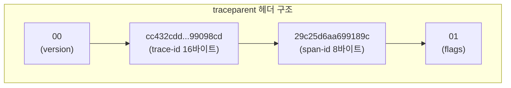
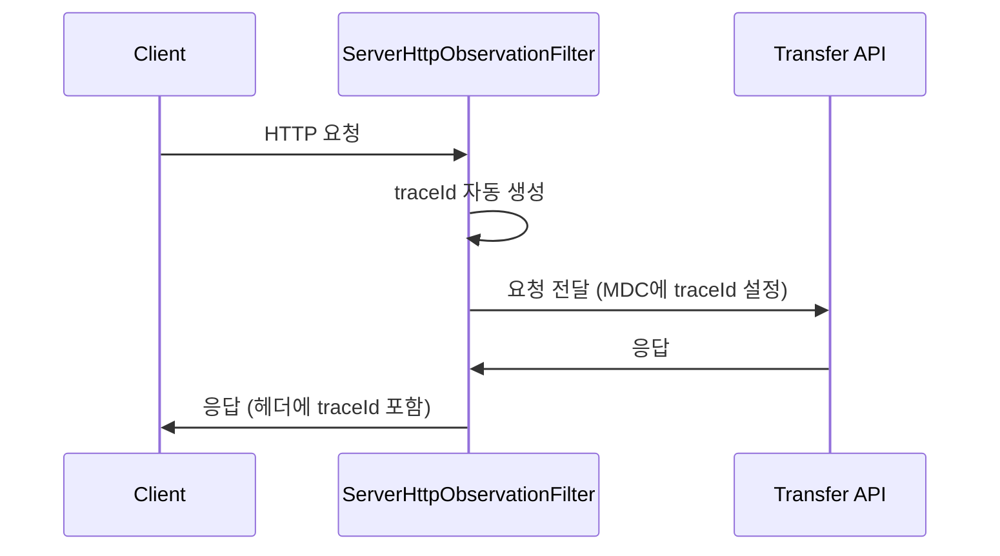
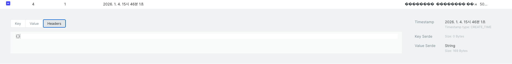
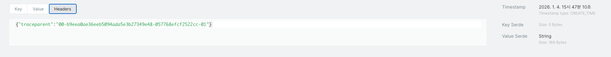
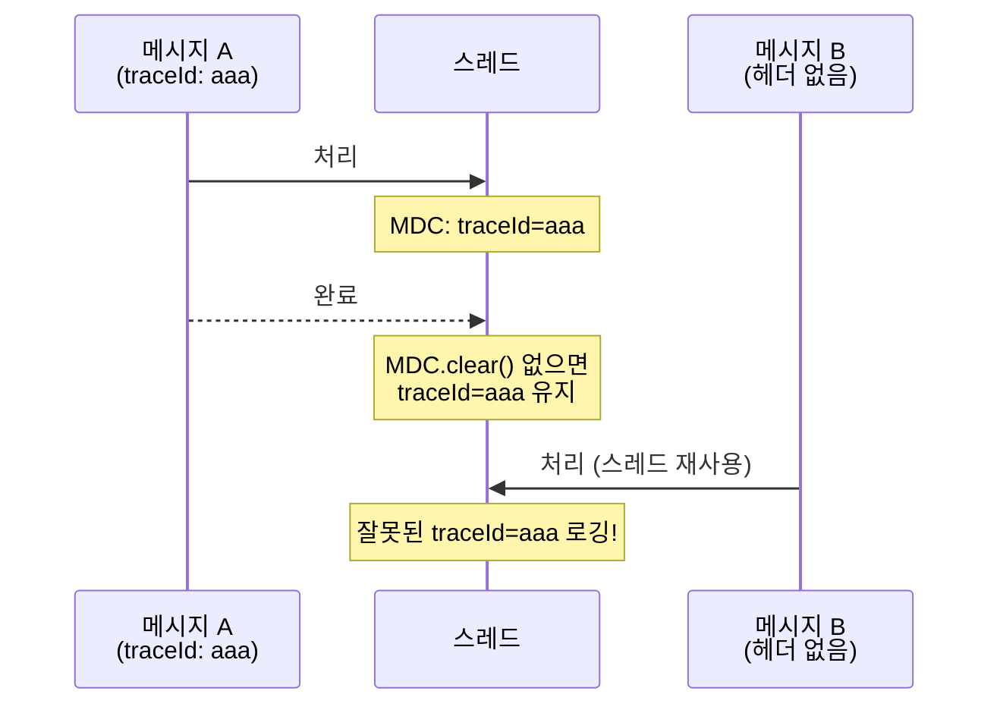
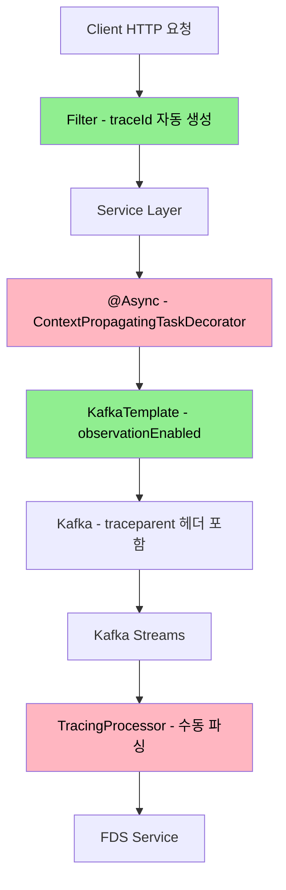
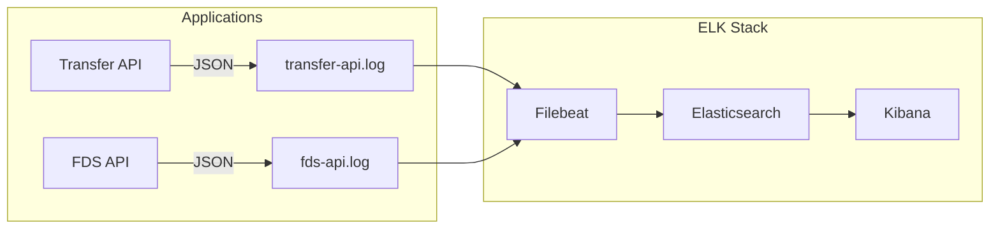
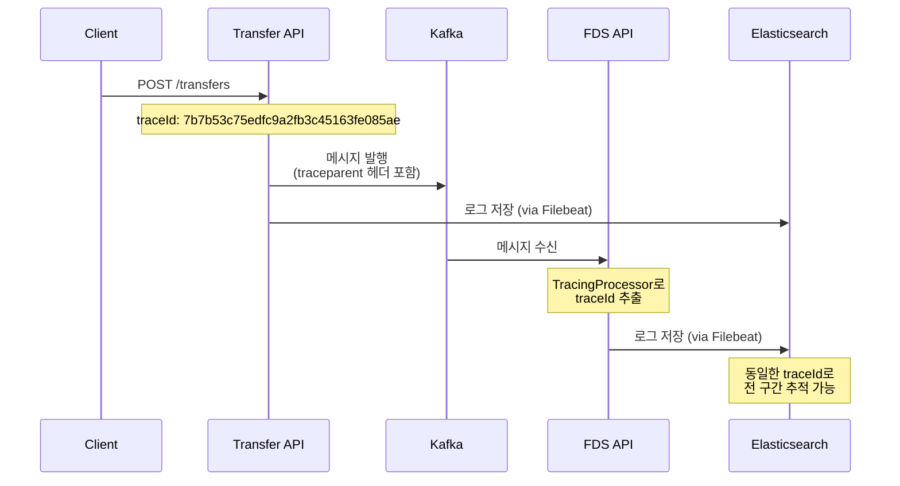
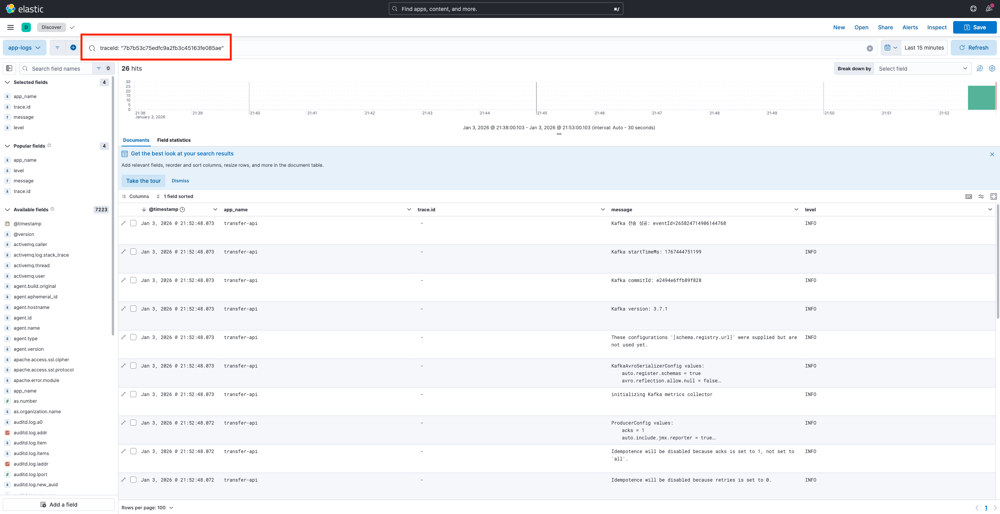

# 분산 시스템에서 로그 추적하기 - B3 와 W3C, 그리고 ELK Stack 구축

## 들어가며

MSA 환경에서 하나의 요청이 여러 서비스를 거쳐갈 때, 문제가 생기면 어디서 발생했는지 찾기가 매우 어렵다. 각 서비스마다 로그가 따로 쌓이기 때문이다.

```
[Transfer API] 09:00:00.123 송금 요청 수신
[FDS API]      09:00:00.456 사기 탐지 처리 중
[Transfer API] 09:00:01.789 에러 발생!
```

이 세 개의 로그가 같은 요청인지 어떻게 알 수 있을까?

---

## 분산 트레이싱의 골자는 Trace Context 전파

### B3 Propagation (Zipkin 표준)

과거 Zipkin 트레이싱 시스템에서 사용하던 표준이다.

```
X-B3-TraceId: 80f198ee56343ba864fe8b2a57d3eff7
X-B3-SpanId: e457b5a2e4d86bd1
X-B3-ParentSpanId: 05e3ac9a4f6e3b90
X-B3-Sampled: 1
```

4개의 헤더를 사용해서 컨텍스트를 전파한다.  
단순하고 직관적이지만, 헤더가 많다는 단점이 있다.

### W3C Trace Context (현재 표준)

W3C에서 표준화한 방식으로, 현재 대부분의 APM 도구들이 이 방식을 지원한다.



```
traceparent: 00-cc432cdd40430597f1660a25a99098cd-29c25d6aa699189c-01
```

하나의 헤더에 모든 정보를 담아 전파한다.

### B3 vs W3C 의 차이

| 항목 | B3 | W3C |
|------|-----|-----|
| 헤더 수 | 4개 | 1개 (traceparent) |
| 표준화 | Zipkin 커뮤니티 | W3C 공식 표준 |
| 채택 현황 | 레거시 | 현재 표준 |
| 지원 도구 | Zipkin, Jaeger | OpenTelemetry, 대부분 APM |

---

## Spring Boot에서 Trace Context 전파

### 자동으로 전파되는 경우

Micrometer Tracing + OpenTelemetry 브릿지를 설정하면 HTTP 요청/응답에서는 자동으로 전파된다.

```kotlin
// build.gradle.kts (SpringBootAppConventionPlugin)
dependencies {
    implementation("org.springframework.boot:spring-boot-starter-actuator")
    implementation("io.micrometer:micrometer-registry-prometheus")
    implementation("io.micrometer:micrometer-tracing-bridge-otel")
}
```



### 수동 처리가 필요한 경우

문제는 **모든 구간이 자동으로 전파되지 않는다**는 점이다.

#### @Async 스레드

```kotlin
// 문제: @Async는 새로운 스레드에서 실행되므로 MDC/Observation Context가 전파되지 않음
@Async
fun processAsync() {
    log.info("traceId가 없다!")  // MDC.get("traceId") == null
}
```

```text
15:38:02.568 [ INFO] [524761ffb7da87cfa957ef60b888627a] o.a.k.c.p.ProducerConfig - These configurations '[schema.registry.url]' were supplied but are not used yet.
15:38:02.568 [ INFO] [524761ffb7da87cfa957ef60b888627a] o.a.k.c.u.AppInfoParser - Kafka version: 3.7.1
15:38:02.568 [ INFO] [524761ffb7da87cfa957ef60b888627a] o.a.k.c.u.AppInfoParser - Kafka commitId: e2494e6ffb89f828
15:38:02.568 [ INFO] [524761ffb7da87cfa957ef60b888627a] o.a.k.c.u.AppInfoParser - Kafka startTimeMs: 1767508682568
15:38:02.574 [ INFO] [] o.a.k.clients.Metadata - [Producer clientId=transfer-api-producer-1] Cluster ID: aaaaaaaaaaaaaaaaaaaaaa
15:38:03.246 [ INFO] [] i.g.h.t.i.a.KafkaTransferEventPublisher - Kafka 전송 성공: eventId=266092862536421376
                      ㄴ 없음 주의
```

**해결: ContextPropagatingTaskDecorator 적용**

```kotlin
@Configuration
@EnableAsync
class AsyncConfig {

    @Bean("outboxEventExecutor")
    fun outboxEventExecutor(): Executor {
        val executor = ThreadPoolTaskExecutor()
        executor.corePoolSize = 3
        executor.maxPoolSize = 10
        executor.queueCapacity = 50
        executor.setThreadNamePrefix("outbox-event-")
        executor.setRejectedExecutionHandler(ThreadPoolExecutor.CallerRunsPolicy())
        executor.setWaitForTasksToCompleteOnShutdown(true)
        executor.setAwaitTerminationSeconds(30)

        // Spring Boot 3.0+ ContextPropagatingTaskDecorator
        // MDC + Micrometer Observation Context 모두 전파
        executor.setTaskDecorator(ContextPropagatingTaskDecorator())

        executor.initialize()
        return executor
    }
}
```

```text
15:40:21.161 [ INFO] [c74a3b531cb4e71a6f3860718bb001e3] o.a.k.c.p.ProducerConfig - These configurations '[schema.registry.url]' were supplied but are not used yet.
15:40:21.162 [ INFO] [c74a3b531cb4e71a6f3860718bb001e3] o.a.k.c.u.AppInfoParser - Kafka version: 3.7.1
15:40:21.162 [ INFO] [c74a3b531cb4e71a6f3860718bb001e3] o.a.k.c.u.AppInfoParser - Kafka commitId: e2494e6ffb89f828
15:40:21.162 [ INFO] [c74a3b531cb4e71a6f3860718bb001e3] o.a.k.c.u.AppInfoParser - Kafka startTimeMs: 1767508821161
15:40:21.166 [ INFO] [] o.a.k.clients.Metadata - [Producer clientId=transfer-api-producer-1] Cluster ID: aaaaaaaaaaaaaaaaaaaaaa
15:40:21.561 [ INFO] [c74a3b531cb4e71a6f3860718bb001e3] i.g.h.t.i.a.KafkaTransferEventPublisher - Kafka 전송 성공: eventId=266093443950841856
                         ㄴ 존재 한다.
```

#### Kafka Producer

KafkaTemplate Bean 생성 시 observation 설정이 필요하다.


> kafka ui 에서 message 텝에 headers 가 비어있는것을 확인

```kotlin
@Configuration
class KafkaProducerConfig<K : Serializable, V : SpecificRecordBase>(
    private val kafkaConfigData: KafkaConfigData,
    private val kafkaProducerConfigData: KafkaProducerConfigData
) {

    @Bean
    fun kafkaTemplate(): KafkaTemplate<K, V> {
        return KafkaTemplate(producerFactory()).apply {
            setObservationEnabled(true)  // 핵심 기능
        }
    }
}
```



이 설정이 있어야 Kafka 메시지 헤더에 `traceparent`가 자동으로 추가된다.

#### Kafka Streams

가장 까다로운 구간이다. Kafka Streams는 Micrometer Observation을 지원하지 않는다.

> Kafka Streams 3.3+에서 `transformValues()`가 deprecated 되어 `FixedKeyProcessor` API로 마이그레이션

```kotlin
/**
 * Kafka Record 헤더에서 traceparent를 추출하여 MDC에 설정하는 Processor
 * 
 * Kafka Streams는 일반 KafkaConsumer와 달리 observationEnabled가 적용되지 않아서
 * 수동으로 W3C Trace Context 헤더를 파싱해야 함
 * 
 * traceparent 형식: {version}-{traceId}-{spanId}-{flags}
 * 
 * @example
 * 00-130c0e23e150eb0ec69d4a4774cc1f03-47684cf7bc701ad3-01
 */
class TracingProcessor : FixedKeyProcessor<String, TransferEventAvroModel, TransferEventAvroModel> {
    
    private lateinit var context: FixedKeyProcessorContext<String, TransferEventAvroModel>

    override fun init(context: FixedKeyProcessorContext<String, TransferEventAvroModel>) {
        this.context = context
    }

    override fun process(record: FixedKeyRecord<String, TransferEventAvroModel>) {
        // 이전 MDC 정리 (스레드 풀 재사용 대비)
        MDC.clear()
        
        val traceparent = record.headers().lastHeader("traceparent")?.value()?.let { String(it) }
        
        if (traceparent != null) {
            // traceparent 형식: 00-{traceId}-{spanId}-{flags}
            val parts = traceparent.split("-")
            if (parts.size >= 3) {
                MDC.put("traceId", parts[1])
                MDC.put("spanId", parts[2])
            }
        }
        
        // 다음 processor로 전달
        context.forward(record)
    }

    override fun close() {
        MDC.clear()
    }
}
```

**MDC.clear()가 필요한 이유:**

Kafka Streams는 스레드 풀을 재사용한다.  
만약 이전 메시지의 traceId가 MDC에 남아있으면 다음 메시지에서 잘못된 traceId가 로깅될 수 있다.



---

## 전 구간 Trace 전파 아키텍처

최종적으로 구현한 아키텍처는 다음과 같다.



> 녹색: 자동 전파  
> 분홍색: 수동 설정 필요

**자동 vs 수동 정리:**

| 구간 | 전파 방식 | 설정 위치 |
|------|----------|----------|
| HTTP 요청/응답 | 자동 | Micrometer Tracing |
| @Async 스레드 | 수동 | AsyncConfig.kt |
| Kafka Producer | 자동 | KafkaProducerConfig.kt |
| Kafka Streams | 수동 | TracingProcessor.kt |

---

## ELK Stack으로 분산 로그 수집

### Filebeat 방식

로그를 Elasticsearch로 보내는 방법은 크게 두 가지다.

#### 직접 전송 방식


앱에서 Elasticsearch로 직접 로그를 전송한다. 설정이 간단하지만 문제가 있다.

- **ES 장애 시**: 로그 전송 실패 -> 앱에서 재시도 -> 앱 성능 저하 또는 블로킹
- **네트워크 순단 시**: 전송 중이던 로그 유실
- **원본 없음**: ES에 문제 생기면 복구 불가

#### Filebeat 에이전트 방식


앱은 로컬 파일에만 쓰고, Filebeat가 수집해서 ES로 전송한다.

- **ES 장애 시**: 파일에는 계속 쌓이고, ES 복구 후 Filebeat가 이어서 전송하는 방식
- **원본 보존**: 로그 파일이 서버에 남아있어 언제든 재처리 가능
- **앱 분리**: 로그 수집 문제가 앱 성능에 영향을 주지 않음

#### 선택 이유

| 방식 | 장점 | 단점 |
|------|------|------|
| 직접 전송 | 설정 간단 | ES 장애 시 앱 블로킹 / 유실 |
| Filebeat | 앱 분리, 버퍼링, 파일 보관 | 설정 복잡 |

FDS(Fraud Detection System) 도메인 특성상 금융과 관련되어, **로그 유실은 고생길이 열리기 마련**이다.

파일 기반으로 먼저 저장하고 수집하는 Filebeat 방식이 더 안전하다고 판단했다.

### 아키텍처



### Docker Compose 구성

```yaml
elasticsearch:
  image: docker.elastic.co/elasticsearch/elasticsearch:8.11.0  # Elastic 공식 이미지
  container_name: transfer-elasticsearch
  restart: unless-stopped                      # 수동 중지 전까지 자동 재시작
  ports:
    - "9200:9200"                              # REST API 포트
  environment:
    - discovery.type=single-node               # 클러스터 없이 단일 노드로 실행
    - xpack.security.enabled=false             # 인증 비활성화 (로컬 개발용)
    - "ES_JAVA_OPTS=-Xms512m -Xmx512m"         # JVM 힙 메모리 512MB 고정
  volumes:
    - es_data:/usr/share/elasticsearch/data    # 인덱스 데이터 영속화
  healthcheck:
    test: ["CMD-SHELL", "curl -s http://localhost:9200/_cluster/health | grep -q status"]
    interval: 10s                              # 10초마다 헬스체크
    timeout: 5s                                # 5초 내 응답 없으면 실패
    retries: 10                                # 10번 실패 시 unhealthy

kibana:
  image: docker.elastic.co/kibana/kibana:8.11.0
  container_name: transfer-kibana
  restart: unless-stopped
  ports:
    - "5601:5601"                              # Kibana 웹 UI 포트
  environment:
    - ELASTICSEARCH_HOSTS=http://elasticsearch:9200  # ES 연결 주소 (컨테이너명 사용)
  depends_on:
    elasticsearch:
      condition: service_healthy               # ES 헬스체크 통과 후 시작

filebeat:
  image: docker.elastic.co/beats/filebeat:8.11.0
  container_name: transfer-filebeat
  restart: unless-stopped
  user: root                                   # 로그 파일 읽기 권한 확보
  volumes:
    - ./monitoring/filebeat.yml:/usr/share/filebeat/filebeat.yml:ro  # 설정 파일 마운트 (읽기전용)
    - ./logs:/var/log/apps:ro                  # 앱 로그 디렉토리 마운트 (읽기전용)
  depends_on:
    elasticsearch:
      condition: service_healthy               # ES 준비 후 시작
  command: filebeat -e -strict.perms=false     # -e: stderr 출력, -strict.perms=false: 권한 체크 무시
```

### Filebeat 설정

```yaml
# monitoring/filebeat.yml
filebeat.inputs:
  - type: log                        # 로그 파일 수집 타입
    enabled: true
    paths:
      - /var/log/apps/*.log          # 수집할 로그 파일 경로 (Docker 볼륨 마운트된 경로)
    json.keys_under_root: true       # JSON 필드를 최상위로 올림 (중첩 없이)
    json.add_error_key: true         # JSON 파싱 실패 시 error.message 필드 추가
    json.message_key: message        # 원본 메시지를 담을 필드명
    fields:
      environment: local             # 커스텀 필드 추가 (환경 구분용)
    fields_under_root: true          # 커스텀 필드도 최상위로 올림

output.elasticsearch:
  hosts: ["elasticsearch:9200"]      # ES 주소 (Docker 네트워크 내 컨테이너명)
  index: "app-logs-%{+yyyy.MM.dd}"   # 인덱스명 패턴 (일별 생성)

setup.template.name: "app-logs"      # 인덱스 템플릿 이름
setup.template.pattern: "app-logs-*" # 템플릿 적용 대상 패턴
setup.ilm.enabled: false             # Index Lifecycle Management 비활성화 (단순화)
```

### Logback JSON 출력 설정

```xml
<configuration>
    <property name="LOG_PATH" value="${LOG_PATH:-/Users/hyungki/project/back-end/logs}" />

    <!-- 콘솔 출력 -->
    <appender name="CONSOLE" class="ch.qos.logback.core.ConsoleAppender">
        <encoder>
            <pattern>%d{HH:mm:ss.SSS} [%5level] [%X{traceId:-}] %logger{25} - %msg%n</pattern>
        </encoder>
    </appender>

    <!-- JSON 파일 출력 (ELK용) -->
    <appender name="JSON_FILE" class="ch.qos.logback.core.rolling.RollingFileAppender">
        <file>${LOG_PATH}/transfer-api.log</file>
        <rollingPolicy class="ch.qos.logback.core.rolling.TimeBasedRollingPolicy">
            <fileNamePattern>${LOG_PATH}/transfer-api.%d{yyyy-MM-dd}.log</fileNamePattern>
            <maxHistory>7</maxHistory>
        </rollingPolicy>
        <encoder class="net.logstash.logback.encoder.LogstashEncoder">
            <includeMdcKeyName>traceId</includeMdcKeyName>
            <includeMdcKeyName>spanId</includeMdcKeyName>
            <customFields>{"app_name":"transfer-api"}</customFields>
        </encoder>
    </appender>

    <root level="INFO">
        <appender-ref ref="CONSOLE" />
        <appender-ref ref="JSON_FILE" />
    </root>
</configuration>
```

**주의 할점은 `service` 필드명 충돌이다.**

처음에 `{"service":"transfer-api"}`로 설정했다가 Filebeat ECS(Elastic Common Schema)의 `service` 필드와 충돌이 발생했다. Filebeat는 `service`를 object로 사용하는데, 우리 로그에서 string으로 사용해서 매핑 에러가 났다.

```
"reason": "object mapping for [service] tried to parse field [service] as object, but found a concrete value"
```

`app_name`으로 변경해서 해결했다.

---

## Kibana에서 traceId로 로그 추적

### Data View 생성

1. Kibana (http://localhost:5601) 접속
2. 햄버거 메뉴 -> Stack Management → Data Views
3. Create data view
4. Index pattern: `app-logs-*`
5. Timestamp field: `@timestamp`

### traceId 검색

Discover에서 검색:

```
traceId: "cc432cdd40430597f1660a25a99098cd"
```

한 번의 송금 요청에 대해 Transfer API와 FDS API의 로그가 동일한 traceId로 묶여서 조회된다.

### 실제 테스트 결과

```bash
curl -X POST http://localhost:8080/transfers \
  -H "Content-Type: application/json" \
  -d '{
    "senderAccountNumber": "110-100-000001",
    "receiverAccountNumber": "110-200-000021",
    "amount": "50000",
    "message": "테스트 송금",
    "currency": "KRW"
  }'
```



---

## 마치며


분산 시스템에서 로그 추적은 단순히 "로그를 모으는 것"이 아니다. 

핵심은 **Trace Context를 전 구간에 걸쳐 끊김 없이 전파하는 것**이다. HTTP, 비동기 스레드, 메시지 큐 등 각 구간마다 전파 방식이 다르고, 자동으로 되는 부분과 수동 처리가 필요한 부분을 정확히 이해해야 한다.

**정리:**

| 해결한 문제 | 적용 기술 |
|------------|----------|
| @Async traceId 유실 | ContextPropagatingTaskDecorator |
| Kafka Producer traceId 전파 | setObservationEnabled(true) |
| Kafka Streams traceId 추출 | TracingProcessor (수동 파싱) |
| 분산 로그 수집 | Filebeat + Elasticsearch |
| 로그 시각화 | Kibana |

다음에는 OpenSearch로 마이그레이션하고 APM 대시보드를 구축하는 과정을 다뤄볼 예정이다.
