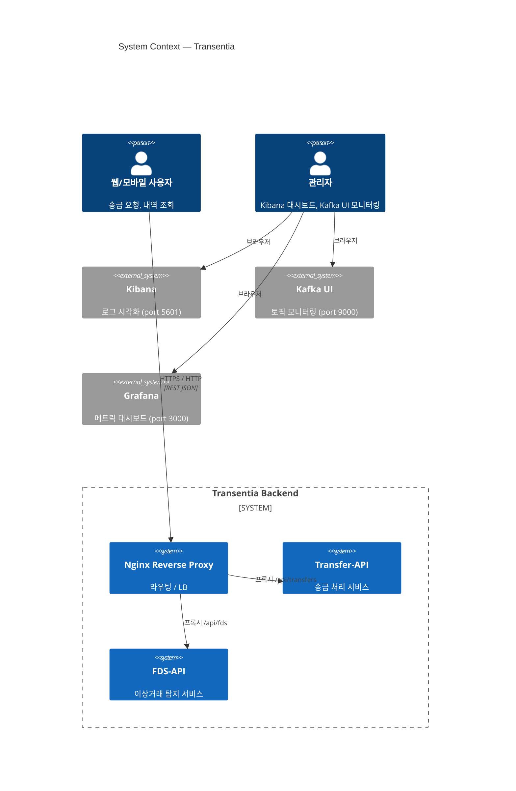
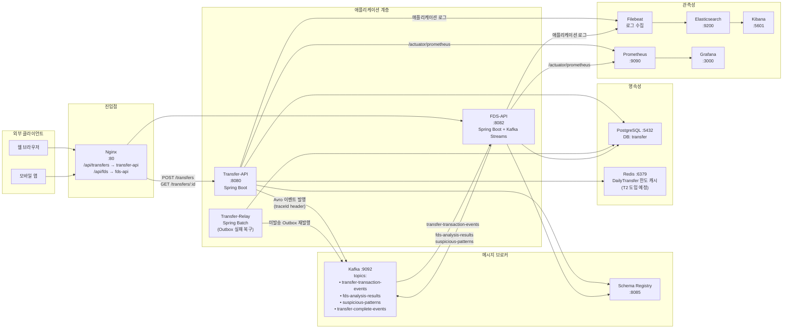
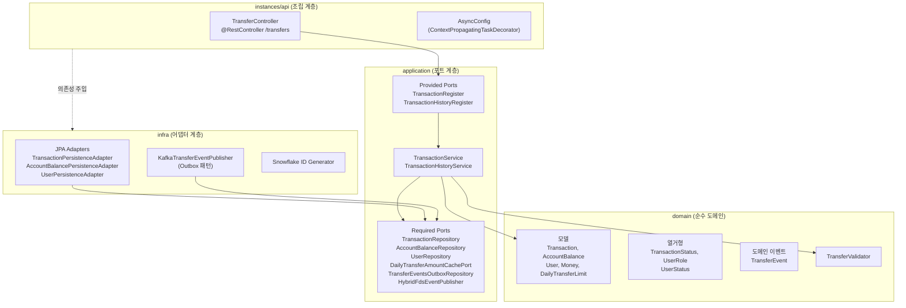
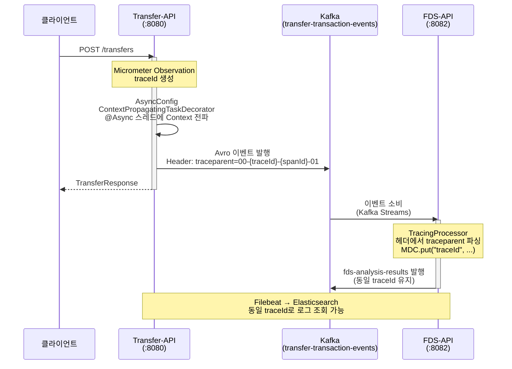
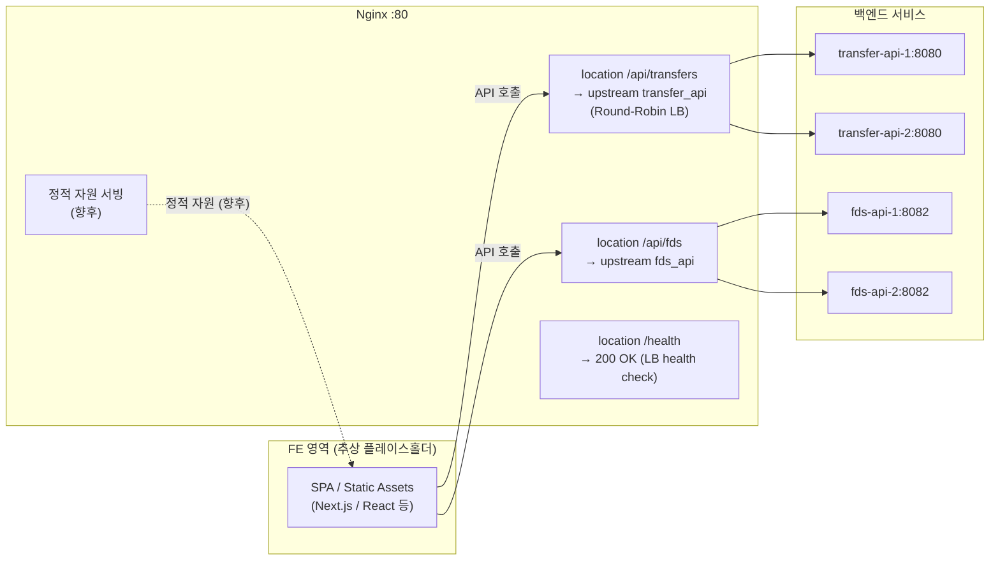

# System Architecture

## 1. 개요

**Transentia**는 Kotlin + Spring Boot 기반 멀티모듈 백엔드로, 송금 처리(Transfer), 이상거래탐지(FDS), ELK 기반 로그 수집·시각화를 통합한 핀테크 학습 프로젝트다.

---

## 2. System Context

외부 행위자가 Nginx를 통해 백엔드 시스템과 상호작용하는 전체 맥락을 표시한다.

---

## 3. Container View

전체 인프라 컴포넌트와 데이터 흐름을 표시한다.

---

## 4. 헥사고날 계층 다이어그램

Transfer 서비스를 기준으로 헥사고날 아키텍처의 레이어 관계를 표시한다. FDS 서비스도 동일한 구조를 따른다.

---

## 5. 분산 트레이싱 흐름

커밋 `3b37ee3`에서 구현된 traceId 전파 경로다. Transfer-API → Kafka 헤더 → FDS-API까지 동일한 traceId가 유지된다.

---

## 6. FE 경계 (Nginx Gateway)

Nginx가 정적 자원 제공과 API 게이트웨이 역할을 함께 수행한다. FE 노드는 현재 구현 범위 외의 추상 플레이스홀더다.

---

## 7. 주요 API 목록

컨트롤러 소스(`services/transfer/instances/api/src`)에서 직접 확인한 엔드포인트다.

### Transfer-API (port 8080)

| 메서드 | 경로 | 설명 | 컨트롤러 |
|--------|------|------|----------|
| `POST` | `/transfers` | 송금 처리 (Avro 이벤트 발행, Outbox 패턴) | `TransferController#create` |
| `GET` | `/transfers/{transactionId}` | 단건 조회 | `TransferController#getTransfer` |
| `GET` | `/actuator/health` | 헬스체크 (Nginx LB용) | Spring Actuator |
| `GET` | `/actuator/prometheus` | Prometheus 메트릭 스크랩 | Spring Actuator |

### FDS-API (port 8082)

| 메서드 | 경로 | 설명 | 비고 |
|--------|------|------|------|
| `GET` | `/actuator/health` | 헬스체크 | Spring Actuator |
| `GET` | `/actuator/prometheus` | 메트릭 | Spring Actuator |

> FDS-API는 REST 엔드포인트를 직접 노출하지 않고, Kafka Streams(`transfer-transaction-events` 구독)를 통해 이벤트를 수신하여 `fds-analysis-results` / `suspicious-patterns` 토픽으로 결과를 발행하는 구조다.

### Kafka 토픽 정의

| 토픽 | 발행자 | 소비자 | 설명 |
|------|--------|--------|------|
| `transfer-transaction-events` | Transfer-API | FDS-API | 송금 완료 이벤트 (Avro) |
| `transfer-complete-events` | Transfer-API | — | 송금 완료 알림용 |
| `fds-analysis-results` | FDS-API | — | FDS 분석 결과 |
| `suspicious-patterns` | FDS-API | — | 10분 윈도우 이상패턴 집계 |
