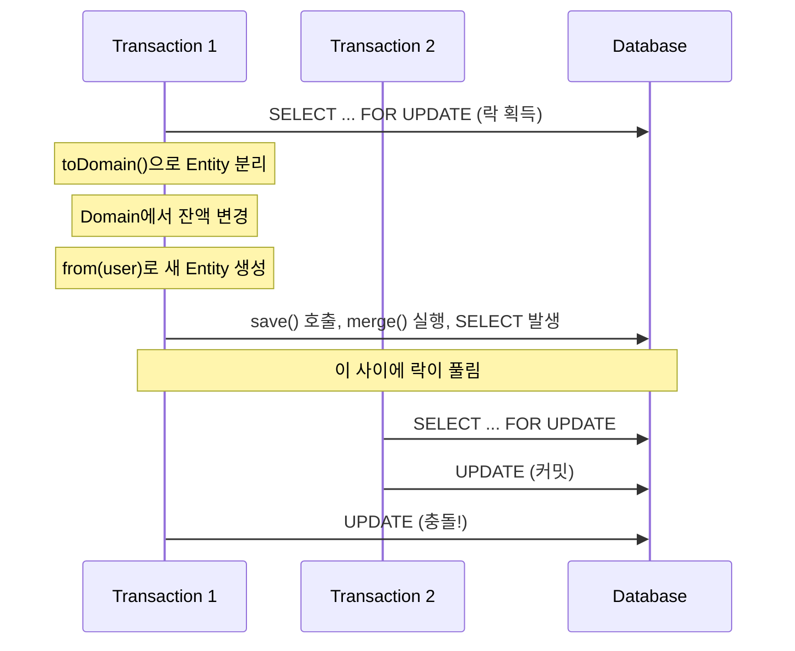
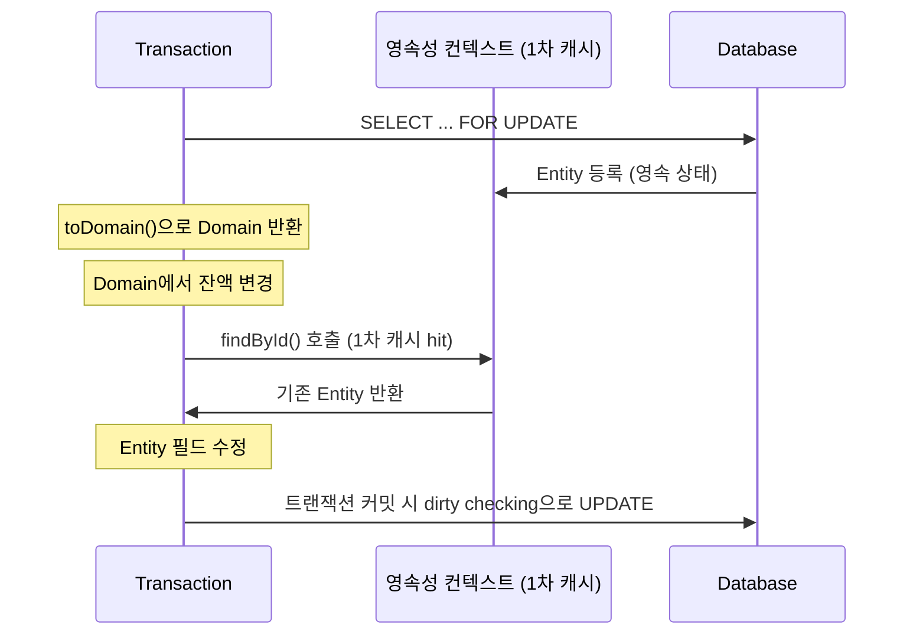

# Hibernate Follow-on Locking 문제 해결

## 증상

```
HHH000444: Encountered request for locking however dialect reports that
database prefers locking be done in a separate select (follow-on locking)
```

부하테스트 시 **80% 에러율** 발생했다.

---

## 문제 원인

### JOIN FETCH + PESSIMISTIC_WRITE 조합

```kotlin
@Lock(LockModeType.PESSIMISTIC_WRITE)
@Query("SELECT u FROM UserJpaEntity u JOIN FETCH u.account WHERE u.id = :id")
fun findByIdWithAccount(id: Long): UserJpaEntity?
```

Hibernate가 이걸 두 쿼리로 분리한다.

```sql
-- 1차 - 데이터 조회
SELECT u.*, a.*
FROM users u
         JOIN accounts a ON...

-- 2차 - 락 획득
    SELECT u.id
FROM users u
WHERE u.id = ? FOR
UPDATE
```

1차와 2차 사이에 다른 트랜잭션이 끼어들 수 있어, 락이 원자적이지 않다.

### 영속성 컨텍스트 분리 문제

- 흐름은 다음과 같다.

1. FOR UPDATE로 락 획득하고 Entity 조회한다. (영속 상태)
2. toDomain() 호출하면 Domain 객체가 반환된다. Entity와 분리된다.
3. Domain에서 잔액을 변경한다.
4. from(user)로 새 Entity를 생성한다. (detached 상태)
5. save()를 호출하면 merge()가 실행되고 SELECT가 다시 발생하게 되는데, 그 사이 다른 트랜잭션이 커밋하면 충돌한다.

```



---

## 해결 방법

### save()에서 영속성 컨텍스트 활용

새 Entity를 생성하지 않고, 영속성 컨텍스트에 있는 기존 Entity를 수정하는 방향으로.

```kotlin
override fun save(user: User): User {
    // 영속성 컨텍스트에서 기존 Entity 조회한다. 1차 캐시에서 hit되면 쿼리가 안 나간다.
    val existingEntity = jpaRepository.findById(user.id.value).orElse(null)

    if (existingEntity != null) {
        // 기존 Entity 필드만 수정한다. dirty checking으로 UPDATE가 나간다.
        existingEntity.account.balance = user.accountBalance.current().minor
        return existingEntity.toDomain()
    }

    // 신규인 경우에만 새 Entity를 생성한다.
    return jpaRepository.save(UserJpaEntity.from(user)).toDomain()
}
```

### 왜 동작할까?

```kotlin
@Transactional
fun createTransfer(command: TransferRequestCommand) {
    // 1. FOR UPDATE로 Entity를 조회하고, 영속성 컨텍스트에 등록된다.
    val (sender, receiver) = loadUsers(command)

    // 2. Domain에서 잔액을 변경하지만, Entity와는 무관하다.
    sender.accountBalance.withdrawOrThrow(amount)

    // 3. save()를 호출한다.
    userRepository.save(sender)
}
```

같은 `@Transactional` 내에서 영속성 컨텍스트는 유지된다.

`save()`에서 `findById()`를 호출하면 1차 캐시에서 같은 Entity를 가져온다  
그 Entity를 수정하면 dirty checking으로 UPDATE가 나간다.



---

## 부하 test 결과

| 항목  | Before                | After                         |
|-----|-----------------------|-------------------------------|
| 에러율 | 80%                   | 0%                            |
| 방식  | 새 Entity 생성 후 merge() | 기존 Entity 수정 후 dirty checking |

---

## 정리

1. JOIN FETCH + PESSIMISTIC_WRITE는 Hibernate에서 follow-on locking을 발생시킨다.
2. toDomain()/from() 변환은 영속성 컨텍스트와 Entity를 분리시킨다.
3. 같은 트랜잭션 내에서 1차 캐시를 활용하면 락을 유지하면서 UPDATE할 수 있다.
4. dirty checking을 활용하면 명시적 save() 없이도 변경이 감지된다.

---

## 대안

| 방안                  | 장점              | 단점                        |
|---------------------|-----------------|---------------------------|
| Dirty Checking (현재) | 도메인 중심 유지       | Entity/Domain 경계 주의 필요하다. |
| JPQL UPDATE         | 빠름, 영속성 컨텍스트 무관 | 도메인 로직이 Repository로 이동    |
| 낙관적 락 + 재시도         | 동시성 높음          | 재시도 로직 필요                 |
