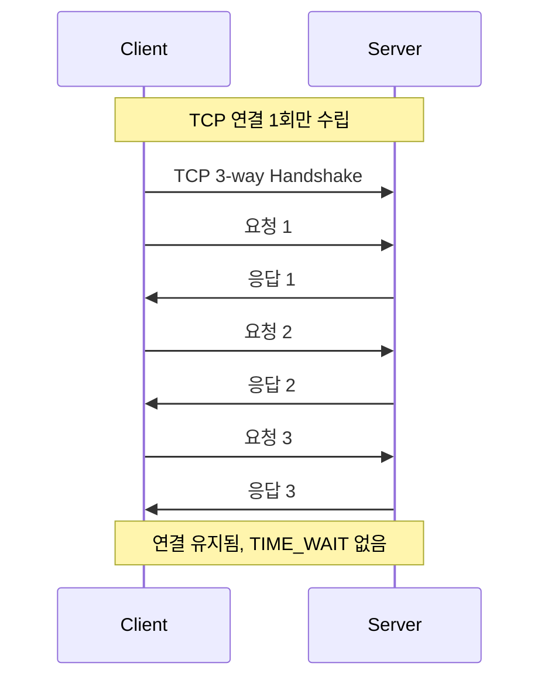
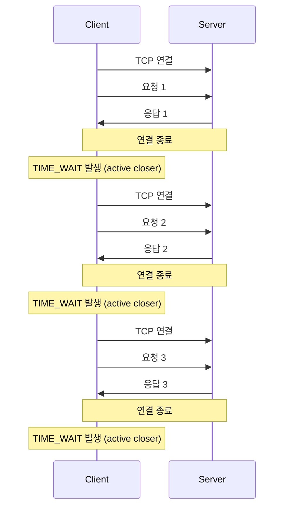
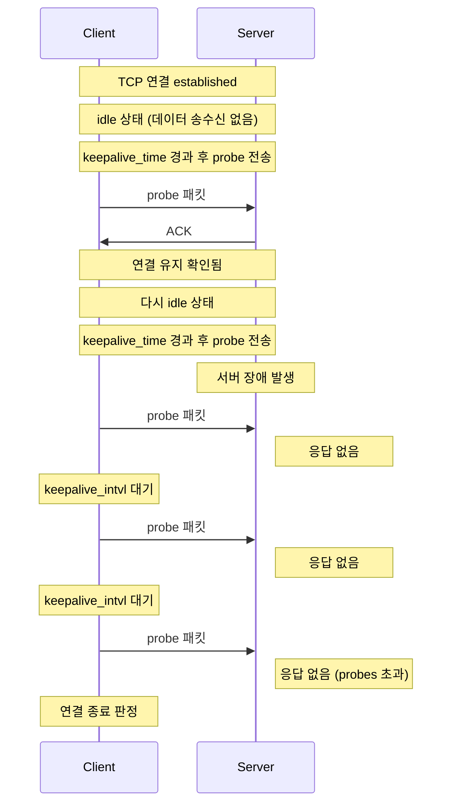
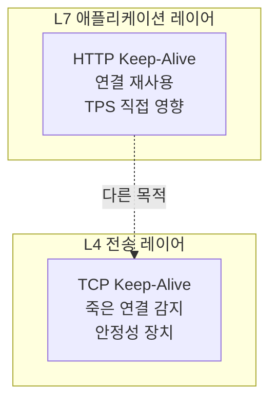
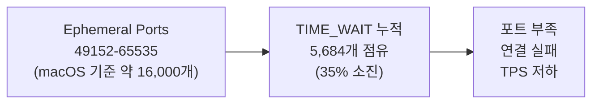
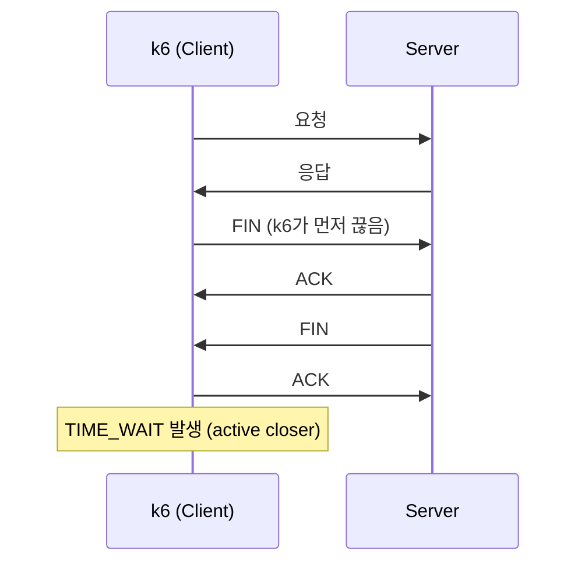
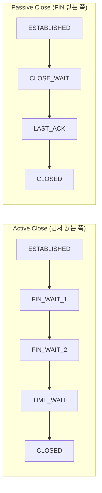
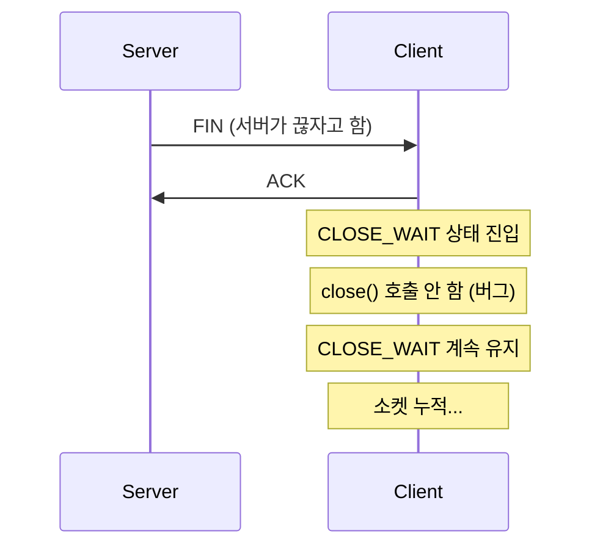
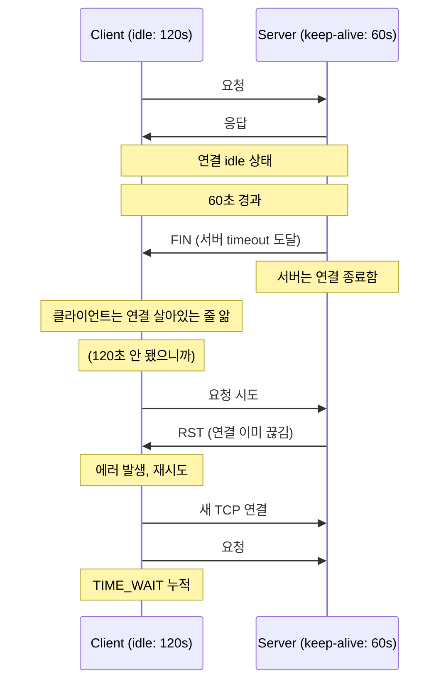
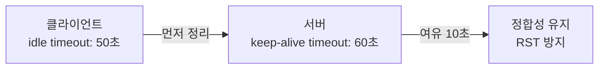

# 분산 시스템에서 네트워크 리소스 효율적으로 관리하기 2편

## 1편에서 이어서

1편에서 Connection Pool의 중요성을 확인했다. TIME_WAIT이 16,275개나 폭발하는 걸 직접 봤으니까.

근데 몇 가지 의문이 남았다.

> "HTTP Keep-Alive랑 TCP Keep-Alive는 같은 거 아니야?"  
> "Keep-Alive 켜면 무조건 TPS 오르는 거 아니야?"  
> "누가 먼저 연결을 끊는 거야?"

이번 편에서는 이 질문들에 답하면서, k6로 직접 테스트해본다.

---

## HTTP Keep-Alive vs TCP Keep-Alive

처음에 이 둘을 같은 거라고 생각했다. 둘 다 "Keep-Alive"니까.

근데 완전히 다른 레이어에서 동작하는 완전히 다른 개념이었다.

### HTTP Keep-Alive

**애플리케이션 레벨(L7)** 에서 동작한다.

하나의 TCP 연결을 여러 HTTP 요청에 재사용하는 것이 핵심이다.

#### Keep-Alive ON (연결 재사용)



#### Keep-Alive OFF (매번 새 연결)



TIME_WAIT은 연결을 먼저 종료한 쪽(active closer)에 발생하며, k6 같은 HTTP client 부하 테스트 환경에서는 일반적으로 클라이언트 측에 누적된다.

**TPS에 직접 영향을 준다.**

### TCP Keep-Alive

**커널 레벨(L4)** 에서 동작한다.

오랫동안 idle 상태인 TCP 연결이 실제로 살아있는지 확인하는 것이 목적이다.

TCP Keep-Alive probe는 payload 없는 ACK 패킷으로, 상대가 비정상적으로 종료되었거나 네트워크 상에서 사라졌는지를 커널 레벨에서 확인하기 위한 생존 확인 메커니즘이다.



Linux/macOS 기본값:
```bash
# Linux
sysctl net.ipv4.tcp_keepalive_time    # 7200초 (2시간)
sysctl net.ipv4.tcp_keepalive_intvl   # 75초
sysctl net.ipv4.tcp_keepalive_probes  # 9회

# macOS (단위: 밀리초)
sysctl net.inet.tcp.keepidle          # 7200000ms (2시간)
sysctl net.inet.tcp.keepintvl         # 75000ms
sysctl net.inet.tcp.keepcnt           # 8회
```

**TPS에 직접 영향 없다.** 죽은 연결을 빨리 정리하는 안정성 장치다.

### 정리



| 구분 | HTTP Keep-Alive | TCP Keep-Alive |
|------|-----------------|----------------|
| 레이어 | L7 (애플리케이션) | L4 (전송) |
| 목적 | 연결 재사용 | 죽은 연결 감지 |
| TPS 영향 | **직접 영향** | 간접 영향 (안정성) |

이 구분을 못 하면 TIME_WAIT, Idle Timeout, Pool 튜닝이 전부 섞여서 사고 난다.

---

## k6로 직접 확인해보자

말로만 들으면 와닿지 않는다. 직접 테스트해봤다.

### 테스트 환경

```
- k6 (부하 테스트 도구)
- Docker (nginx → Spring Boot API)
- VU: 20명
- Duration: 10초
- OS: macOS
```

### Keep-Alive ON 테스트

```javascript
// keepalive-test.js
const params = {
  headers: {
    'Content-Type': 'application/json',
    // Connection 헤더 없음 = Keep-Alive 기본 사용
  },
};
```

### Keep-Alive OFF 테스트

```javascript
// no-keepalive-test.js
const params = {
  headers: {
    'Content-Type': 'application/json',
    'Connection': 'close',  // 매 요청마다 연결 종료 강제
  },
};
```

### 결과

```bash
# Keep-Alive ON
k6 run keepalive-test.js
netstat -an | grep TIME_WAIT | wc -l
# 결과: 25개

# Keep-Alive OFF
k6 run no-keepalive-test.js
netstat -an | grep TIME_WAIT | wc -l
# 결과: 5,684개
```

| 테스트 | Keep-Alive | 요청 수 | TPS | TIME_WAIT |
|--------|------------|---------|-----|-----------|
| keepalive-test.js | ON | 4,257 | 424/s | **25개** |
| no-keepalive-test.js | OFF | 5,580 | 557/s | **5,684개** |

**TIME_WAIT: 25개 vs 5,684개 (227배 차이)**

### TPS 수치에 대한 주의사항

Keep-Alive OFF에서 TPS가 더 높게 나온 것은 짧은 테스트 구간(10초)에서는 TCP 연결 생성 비용이 아직 병목으로 작용하지 않았기 때문이다. 

그러나 TIME_WAIT 누적량이 급증하며, 테스트 시간이 길어질수록 포트 고갈 및 연결 생성 지연으로 TPS 하락 가능성이 커진다.



10초 테스트에서 35% 소진이면, 운영 환경에서는 포트 고갈로 이어질 수 있다.

---

## 누가 먼저 끊는 걸까..

테스트하면서 궁금한점은,   
TIME_WAIT은 **먼저 끊는 쪽(active closer)** 에 쌓인다고 했는데,   
여기서 누가 먼저 끊는 것인지가 궁금했다.

> 처음엔, "HTTP/1.1 기본 동작은 서버가 먼저 끊지 않나." 라고 생각했었다.

### 사실

- HTTP/1.1 기본은 Keep-Alive다
- 누가 먼저 끊을지는 **프로토콜이 정하지 않는다**
- 애플리케이션 구현 + 설정 + 트래픽 패턴에 따라 다르다

| 상황 | 누가 FIN 보내나 |
|------|----------------|
| keep-alive timeout 도달 | 서버 |
| 클라이언트가 요청 끝나자마자 close | 클라이언트 |
| k6 같은 부하 테스트 도구 | 거의 항상 클라이언트 |
| 브라우저 | 서버가 먼저 끊는 경우 많음 |

그래서 k6 테스트에서 TIME_WAIT이 **로컬(클라이언트)** 에 쌓인 거다.



---

## CLOSE_WAIT은 뭐야?

TIME_WAIT은 이해했다. 근데 CLOSE_WAIT은 뭘까?

### 상태 전이 비교



| 구분 | Active Close (먼저 끊는 쪽) | Passive Close (FIN 받는 쪽) |
|------|---------------------------|---------------------------|
| 상태 전이 | ESTABLISHED → FIN_WAIT_1 → FIN_WAIT_2 → **TIME_WAIT** → CLOSED | ESTABLISHED → **CLOSE_WAIT** → LAST_ACK → CLOSED |
| 문제 | TIME_WAIT 소켓 폭발 | CLOSE_WAIT 누적 |

### CLOSE_WAIT이 쌓이는 상황



**CLOSE_WAIT이 쌓이면 애플리케이션 버그다.**

close()를 제대로 호출하지 않아서 발생한다. Connection Pool 라이브러리를 잘못 쓰거나, 예외 처리에서 리소스 정리를 안 하면 이런 일이 생긴다.

---

## Idle Timeout 정합성 문제

이제 진짜 문제가 나온다.

### 시나리오

```
서버 keep-alive timeout: 60초
클라이언트 pool idle timeout: 120초
```

이러면 어떻게 될까?



**서버/클라이언트 timeout 불일치가 TIME_WAIT 폭증의 원인이 될 수 있다.**

---

## HTTP 클라이언트별 설정

그러면 각 HTTP 클라이언트에서 어떻게 설정해야 할까?

### RestTemplate (Apache HttpClient 5)

```kotlin
val connectionConfig = ConnectionConfig.custom()
    .setConnectTimeout(Timeout.ofSeconds(3))
    .setSocketTimeout(Timeout.ofSeconds(30))
    .build()

val connectionManager = PoolingHttpClientConnectionManagerBuilder.create()
    .setMaxConnTotal(200)
    .setMaxConnPerRoute(100)
    .setDefaultConnectionConfig(connectionConfig)
    .build()

val httpClient = HttpClientBuilder.create()
    .setConnectionManager(connectionManager)
    .setKeepAliveStrategy { _, _ -> TimeValue.ofSeconds(30) }  // Keep-Alive 시간
    .evictIdleConnections(TimeValue.ofSeconds(60))  // Idle 연결 정리
    .evictExpiredConnections()
    .build()
```

### WebClient (Reactor Netty)

```kotlin
val connectionProvider = ConnectionProvider.builder("custom")
    .maxConnections(200)
    .maxIdleTime(Duration.ofSeconds(60))
    .maxLifeTime(Duration.ofMinutes(5))
    .pendingAcquireTimeout(Duration.ofSeconds(10))
    .build()

val httpClient = HttpClient.create(connectionProvider)
    .option(ChannelOption.CONNECT_TIMEOUT_MILLIS, 3000)
    .responseTimeout(Duration.ofSeconds(30))

val webClient = WebClient.builder()
    .clientConnector(ReactorClientHttpConnector(httpClient))
    .build()
```

### Feign Client

```yaml
# application.yml
feign:
  client:
    config:
      default:
        connectTimeout: 3000
        readTimeout: 30000
  httpclient:
    enabled: true
    max-connections: 200
    max-connections-per-route: 100
    time-to-live: 300
    time-to-live-unit: SECONDS
```

### Retrofit (OkHttp)

```kotlin
val client = OkHttpClient.Builder()
    .connectTimeout(3, TimeUnit.SECONDS)
    .readTimeout(30, TimeUnit.SECONDS)
    .connectionPool(ConnectionPool(100, 5, TimeUnit.MINUTES))
    .build()
```

---

## 정합성 맞추기

서버 설정과 클라이언트 설정을 맞춰야 한다.

### 원칙



```
클라이언트 idle timeout < 서버 keep-alive timeout
```

이렇게 해야 클라이언트가 먼저 연결을 정리해서 "끊긴 연결로 요청 보내기" 문제를 예방할 수 있다.

### 예를 들면

| 설정 | 서버 (Tomcat) | 클라이언트 |
|------|--------------|-----------|
| keep-alive timeout | 60초 | - |
| idle timeout | - | 50초 |
| 여유 | 10초 | - |

```yaml
# 서버 (application.yml)
server:
  tomcat:
    connection-timeout: 10s
    keep-alive-timeout: 60s

# 클라이언트
.evictIdleConnections(TimeValue.ofSeconds(50))  # 서버보다 짧게
```

---

## 정리

| 개념 | 설명 | TPS 영향 |
|------|------|---------|
| HTTP Keep-Alive | 연결 재사용 | 직접 영향 |
| TCP Keep-Alive | 죽은 연결 감지 | 간접 영향 |
| TIME_WAIT | 먼저 끊는 쪽(active closer)에 쌓임 | 포트 고갈 시 영향 |
| CLOSE_WAIT | close() 안 하면 쌓임 | 리소스 누수 |
| Idle Timeout 정합성 | 서버/클라이언트 맞춰야 함 | 불일치 시 TIME_WAIT 폭증 |

---

## 다음 편

3편에서는 Spring Boot 서버 설정을 다룬다.

- Tomcat thread pool
- Keep-Alive timeout
- Connection timeout
- nGrinder로 대규모 부하 테스트

---

*테스트 환경: k6, Docker (nginx + Spring Boot), macOS*
