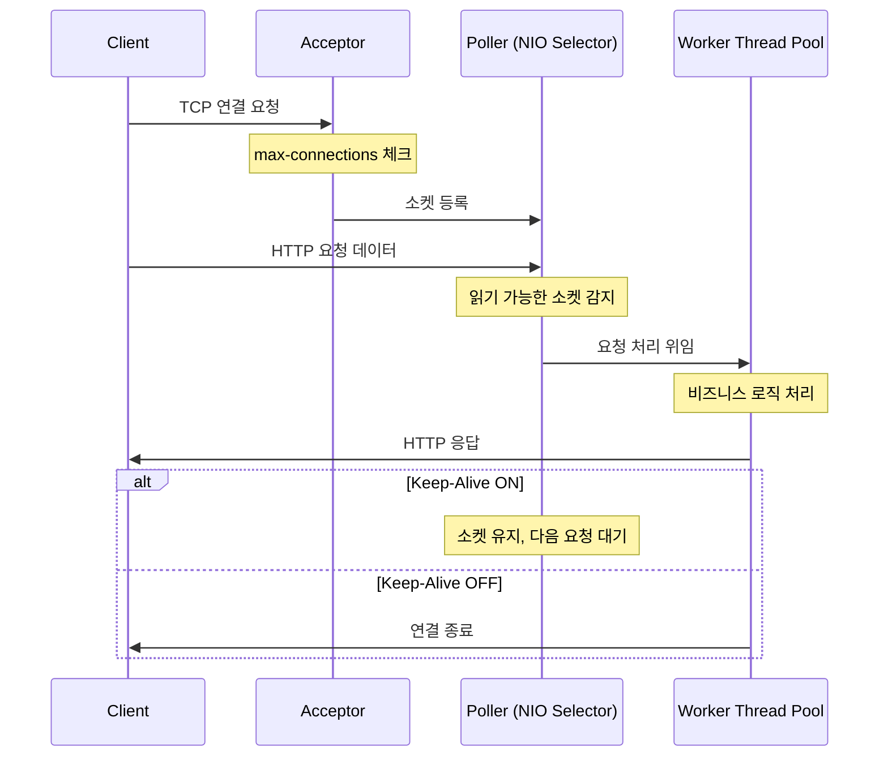
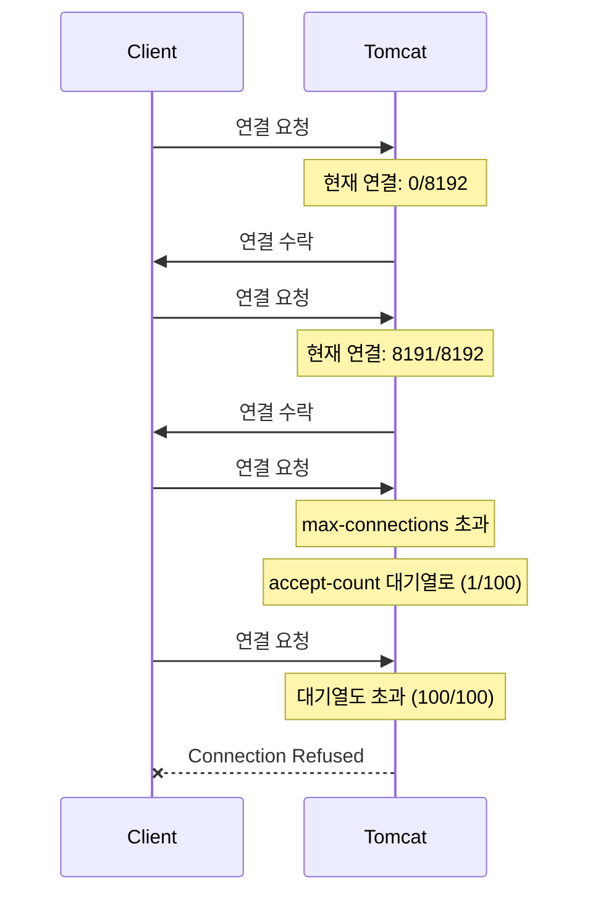
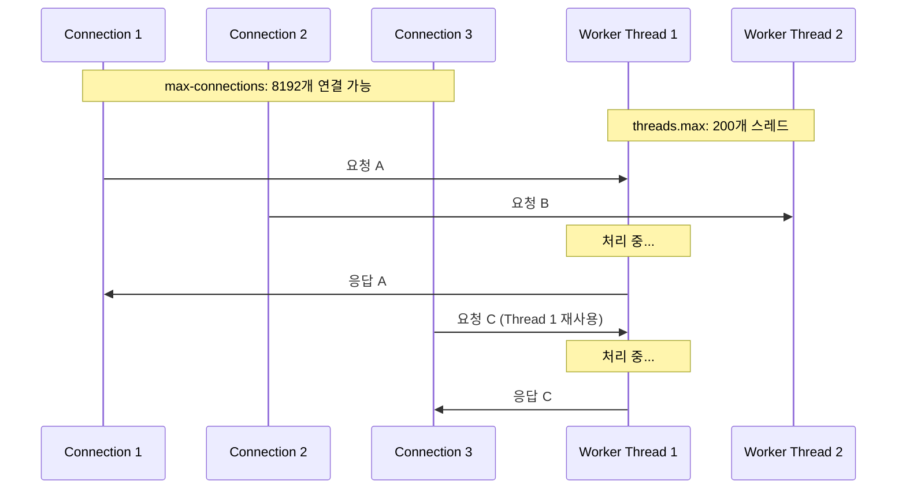
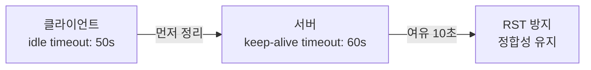
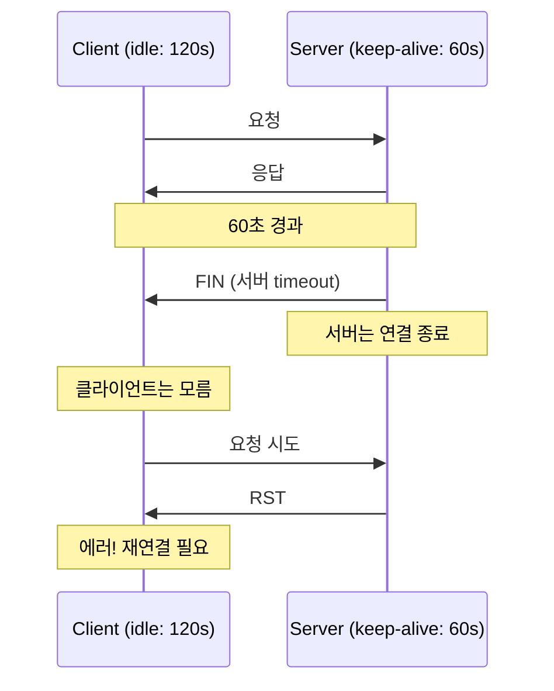
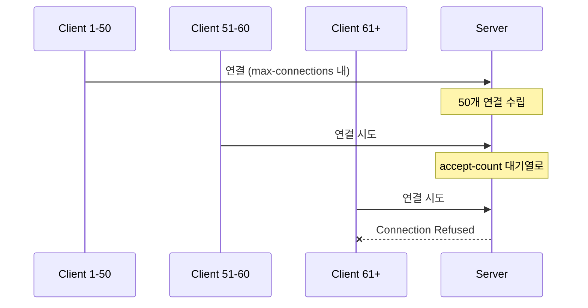
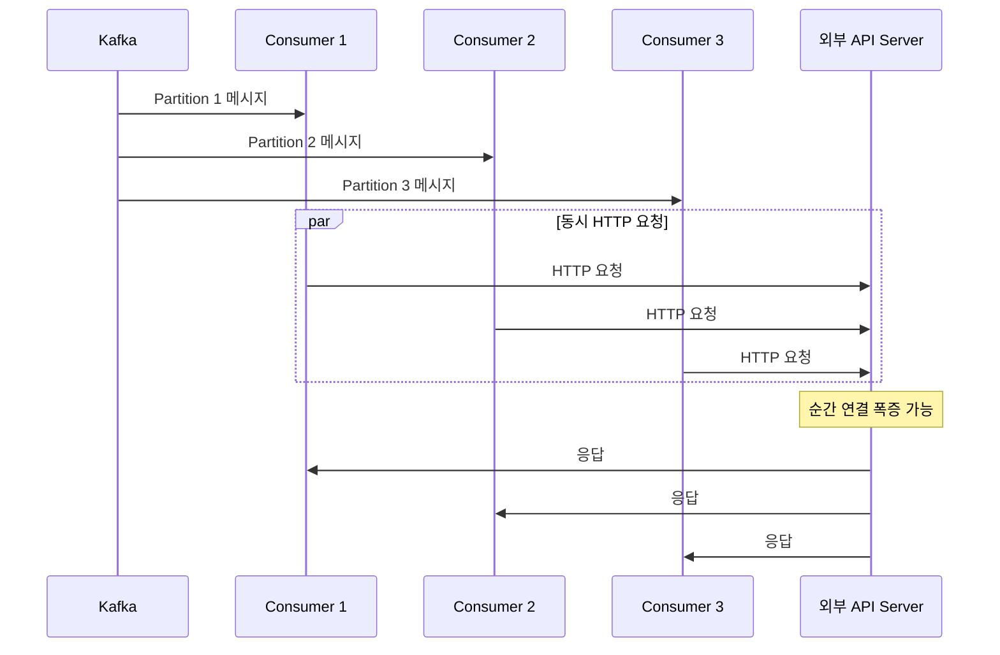
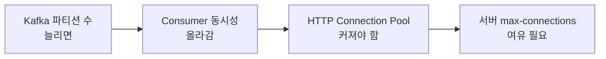

# 분산 시스템에서 네트워크 리소스 효율적으로 관리하기 3편

## 2편에서 이어서

2편에서 HTTP Keep-Alive vs TCP Keep-Alive 차이를 알았고, Idle Timeout 정합성 문제도 확인했다.

근데 한 가지 빠진 게 있다.

> "서버 설정은 어떻게 해야 하는가"

클라이언트 설정만 열심히 해봤자, 서버가 이상하면 소용없다.   
Spring Boot 서버 설정을 Digging 해보자.

---

## Tomcat 기본 구조

Spring Boot는 기본적으로 내장 Tomcat을 사용한다. Tomcat NIO Connector의 요청 처리 흐름을 먼저 이해해야 한다.



### 핵심 컴포넌트

| 컴포넌트 | 역할 | 관련 설정 |
|----------|------|----------|
| Acceptor | TCP 연결 수락 | max-connections, accept-count |
| Poller | NIO Selector로 소켓 이벤트 감시 | - |
| Worker Thread Pool | 실제 HTTP 요청 처리 | threads.max, threads.min-spare |

---

## Spring Boot 서버 설정 옵션

### application.yml 기본 설정

```yaml
server:
  tomcat:
    # 연결 관련
    max-connections: 8192          # 최대 동시 연결 수
    accept-count: 100              # 대기열 크기
    connection-timeout: 20s        # 연결 타임아웃
    keep-alive-timeout: 60s        # Keep-Alive 유지 시간
    max-keep-alive-requests: 100   # Keep-Alive당 최대 요청 수
    
    # 스레드 관련
    threads:
      max: 200                     # 최대 워커 스레드
      min-spare: 10                # 최소 유지 스레드
```

### 연결 수락 흐름



#### max-connections (기본: 8192)

동시에 처리할 수 있는 최대 연결 수다.

```
8192개 연결이 모두 사용 중이면,
새 연결은 accept-count 대기열로 이동한다.
```

#### accept-count (기본: 100)

max-connections가 꽉 찼을 때 대기할 수 있는 요청 수다.

```
대기열도 꽉 찼으면?
연결을 거부한다. (Connection Refused)
```

#### connection-timeout (기본: 20초)

연결 후 첫 번째 요청 데이터가 올 때까지 기다리는 시간이다.

```
20초 안에 데이터가 안 오면?
연결을 종료한다.
```

#### keep-alive-timeout (기본: 60초)

HTTP Keep-Alive 연결을 유지하는 시간이다. **2편에서 말한 정합성 문제의 핵심.**

```
60초 동안 요청이 없으면?
서버가 FIN 보낸다. (연결 종료).
```

#### max-keep-alive-requests (기본: 100)

하나의 Keep-Alive 연결에서 처리할 최대 요청 수다.

```
100개 요청 처리하면?
연결 종료 후 새 연결 필요한 상황이다.
```

---

## 스레드 풀 설정

### threads.max vs max-connections

이게 헷갈린다. 둘 다 "최대" 뭔가인데, 그 "뭔가" 가 무었인지.



| 설정 | 의미 | 비유 |
|------|------|------|
| max-connections | 동시 연결 수 | 식당 좌석 수 |
| threads.max | 동시 처리 스레드 | 주방 요리사 수 |

8192개 연결이 있어도 200개 스레드가 돌아가면서 처리한다. Keep-Alive로 연결은 유지하면서, 스레드는 다른 요청 처리하러 가는 거다.

### 적절한 스레드 수 계산

```
threads.max = (요청당 처리시간 / 목표 응답시간) × 목표 TPS

예시:
- 요청당 처리시간: 100ms
- 목표 TPS: 1000
- threads.max = 0.1 × 1000 = 100

여유를 두고 150~200 정도 설정
```

---

## 타임아웃 정합성 설정

2편에서 배운 내용을 실제로 적용해보자.

### 원칙



### 실제 설정

```yaml
# 서버 (application.yml)
server:
  tomcat:
    keep-alive-timeout: 60s
    connection-timeout: 20s
```

```kotlin
// 클라이언트 (Apache HttpClient)
val httpClient = HttpClientBuilder.create()
    .setConnectionManager(connectionManager)
    .evictIdleConnections(TimeValue.ofSeconds(50))  // 서버 60초보다 짧게
    .build()
```

### 설정 불일치 시 문제



---

## nGrinder로 설정 검증

설정이 제대로 됐는지 확인하려면 부하 테스트가 필요하다.

### 테스트 시나리오

| 시나리오 | 목적 |
|----------|------|
| A | 기본 설정으로 TPS 측정 |
| B | max-connections 낮춰서 병목 확인 |
| C | 스레드 풀 조정 후 비교 |

### 시나리오 A: 기본 설정

```yaml
server:
  tomcat:
    max-connections: 8192
    threads:
      max: 200
```

```groovy
// nGrinder 스크립트
@Test
void test() {
    HTTPResponse response = request.GET("http://localhost:8080/api/test")
    assertThat(response.statusCode).isEqualTo(200)
}
```

### 시나리오 B: max-connections 제한

```yaml
server:
  tomcat:
    max-connections: 50        # 의도적으로 낮춤
    accept-count: 10
    threads:
      max: 200
```



### 예상 결과

| 시나리오 | TPS | 에러율 | 원인 |
|----------|-----|--------|------|
| A | 1000+ | 0% | 정상 |
| B | 300 | 20%+ | max-connections 병목 |
| C | 1200+ | 0% | 스레드 최적화 |

---

## Kafka 파티션 수와의 연결

Kafka 와도 맥락상 연결 되는 부분은 아래와 같다.

### Consumer TPS 계산

```
Consumer TPS = 파티션 수 × 파티션당 처리량
```

### Consumer 로부터 외부 API 호출 구조



### Consumer가 외부 API를 호출될 경우

파티션 3개 × Consumer 3개 × 동시 요청
- 순간적으로 많은 HTTP 연결 발생
- Connection Pool 설정이 중요

### 설정 연결

```yaml
# Kafka Consumer 설정
spring:
  kafka:
    consumer:
      max-poll-records: 500       # 한 번에 가져올 레코드 수
      
# HTTP Client 설정
http:
  client:
    max-connections: 200          # Kafka 파티션 수 × Consumer 수 고려
    max-connections-per-route: 50
```



> 파티션 수를 늘리면 Consumer 동시성이 올라가고, HTTP Connection Pool도 커져야 하고, 서버 max-connections도 여유가 있어야 한다.

---

## 운영 환경 확인 목록

### 서버 (Spring Boot)

```yaml
server:
  tomcat:
    max-connections: 8192
    accept-count: 100
    connection-timeout: 20s
    keep-alive-timeout: 60s
    max-keep-alive-requests: 100
    threads:
      max: 200
      min-spare: 10
```

### 클라이언트 (Apache HttpClient)

```kotlin
val connectionManager = PoolingHttpClientConnectionManagerBuilder.create()
    .setMaxConnTotal(200)
    .setMaxConnPerRoute(50)
    .build()

val httpClient = HttpClientBuilder.create()
    .setConnectionManager(connectionManager)
    .evictIdleConnections(TimeValue.ofSeconds(50))  // 서버보다 짧게
    .evictExpiredConnections()
    .build()
```

### 검증하고자 하는것

| 항목 | 확인 방법 | 정상 기준 |
|------|----------|----------|
| TIME_WAIT | `netstat -an \| grep TIME_WAIT \| wc -l` | 수백 개 이하 |
| CLOSE_WAIT | `netstat -an \| grep CLOSE_WAIT \| wc -l` | 0개 |
| 연결 수 | `netstat -an \| grep ESTABLISHED \| wc -l` | max-connections 이하 |
| 스레드 | Actuator `/actuator/metrics/tomcat.threads.busy` | max 이하 |

---

## 모니터링 설정

### Actuator 활성화

```yaml
management:
  endpoints:
    web:
      exposure:
        include: health,metrics,prometheus
  metrics:
    tags:
      application: ${spring.application.name}
```

### 주요 메트릭

| 메트릭 | 의미 | 주의 기준 |
|--------|------|----------|
| tomcat.threads.busy | 사용 중인 스레드 | max의 80% 초과 시 |
| tomcat.threads.current | 현재 스레드 수 | - |
| tomcat.connections.current | 현재 연결 수 | max-connections의 80% 초과 시 |
| tomcat.connections.keepalive | Keep-Alive 연결 수 | - |

### Grafana 대시보드 쿼리 예시

```promql
# 스레드 사용률
tomcat_threads_busy_threads / tomcat_threads_config_max_threads * 100

# 연결 사용률
tomcat_connections_current_connections / tomcat_connections_config_max_connections * 100
```

---

## 정리

| 설정 | 기본값 | 권장 조정 | 영향 |
|------|--------|----------|------|
| max-connections | 8192 | 트래픽에 맞게 | 동시 연결 수 |
| threads.max | 200 | TPS 목표에 맞게 | 처리량 |
| keep-alive-timeout | 60s | 클라이언트보다 길게 | 정합성 |
| connection-timeout | 20s | 네트워크 환경에 맞게 | 느린 클라이언트 처리 |


```
1. 클라이언트 idle timeout < 서버 keep-alive timeout
2. max-connections > 예상 동시 연결 수
3. threads.max는 CPU 코어 × 2~4 정도에서 시작
4. 모니터링으로 실제 사용량 확인 후 튜닝
```

---

*테스트 환경: Spring Boot 3.3.2, Tomcat 10, nGrinder, macOS*
