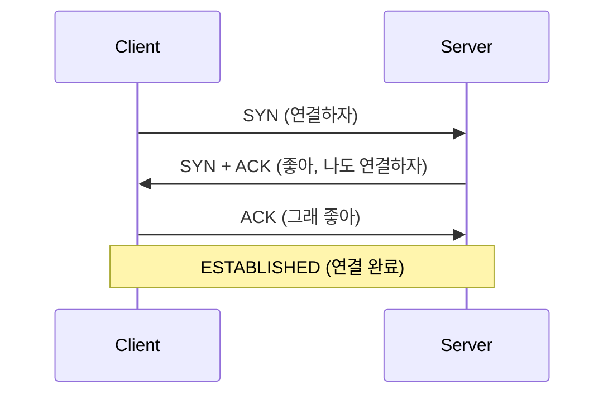
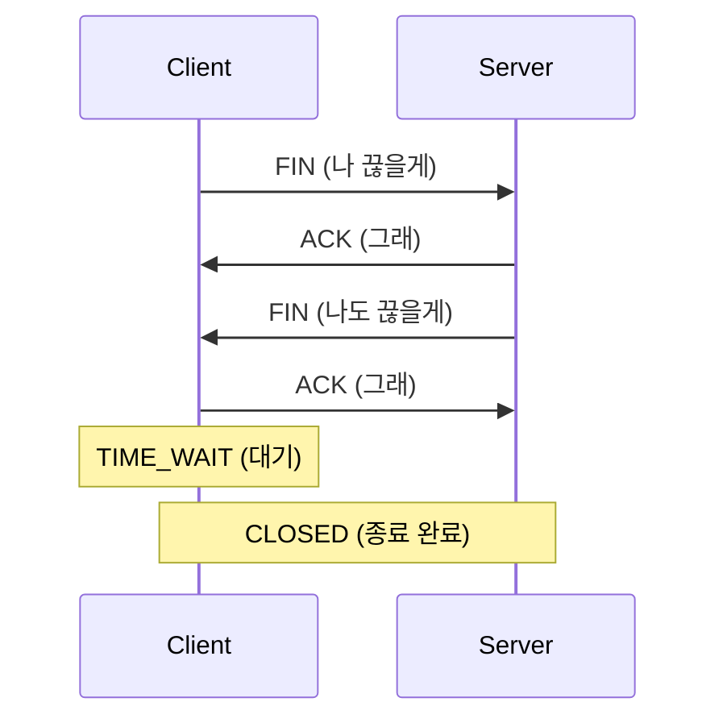
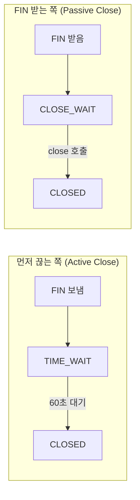

# TCP 용어 정리

이 문서는 1~3편을 읽다가 헷갈릴 때 참고하는 용도다.

---

## TCP 연결/종료

### 3-way Handshake (연결)



### 4-way Handshake (종료)



**왜 종료는 4번인지?**

> 연결할 때는 서버가 SYN+ACK를 한 번에 보낸다.  
그런데, 종료할 때는 서버가 아직 보낼 데이터가 있을 수 있어서 ACK와 FIN을 따로 보낸다.

---

## 소켓 상태

- 아래만 기억하자...

| 상태 | 한 줄 요약 | 쌓이면? |
|------|-----------|---------|
| **ESTABLISHED** | 연결 중 | 정상 |
| **TIME_WAIT** | 먼저 끊은 쪽이 대기 중 | 포트 고갈 |
| **CLOSE_WAIT** | FIN 받았는데 close() 안 함 | 버그 |

나머지(FIN_WAIT_1, FIN_WAIT_2, LAST_ACK 등)는 중간 단계라 금방 지나간다.

---

## TIME_WAIT vs CLOSE_WAIT

- 이 둘의 정체는 다음과 같다.



| 구분 | TIME_WAIT | CLOSE_WAIT |
|------|-----------|------------|
| 발생 | 먼저 끊는 쪽 | FIN 받는 쪽 |
| 쌓이는 이유 | 연결 재사용 안 함 | close() 호출 안 함 |
| 해결 | Connection Pool | 코드 수정 |
| 성격 | 정상 동작 (많으면 문제) | 버그 |

---

## 확인 명령어

```bash
# TIME_WAIT 개수
netstat -an | grep TIME_WAIT | wc -l

# CLOSE_WAIT 개수
netstat -an | grep CLOSE_WAIT | wc -l

# 실시간 모니터링
watch -n 1 "netstat -an | grep TIME_WAIT | wc -l"
```

---

## Keep-Alive 구분

| 구분 | HTTP Keep-Alive | TCP Keep-Alive |
|------|-----------------|----------------|
| 레이어 | L7 (애플리케이션) | L4 (커널) |
| 목적 | 연결 재사용 | 죽은 연결 감지 |
| TPS 영향 | **직접** | 간접 (안정성) |

---

## Timeout 용어

| 용어 | 의미 |
|------|------|
| connection-timeout | 연결 수립까지 대기 시간 |
| read-timeout (socket-timeout) | 응답 대기 시간 |
| keep-alive-timeout | 연결 유지 시간 (서버) |
| idle-timeout | 연결 유지 시간 (클라이언트) |

**정합성 원칙:**
```
클라이언트 idle-timeout < 서버 keep-alive-timeout
```

