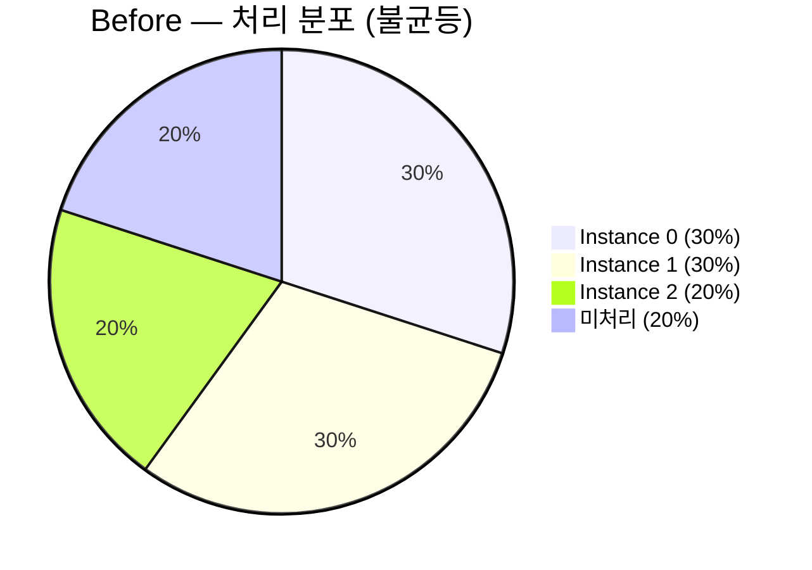
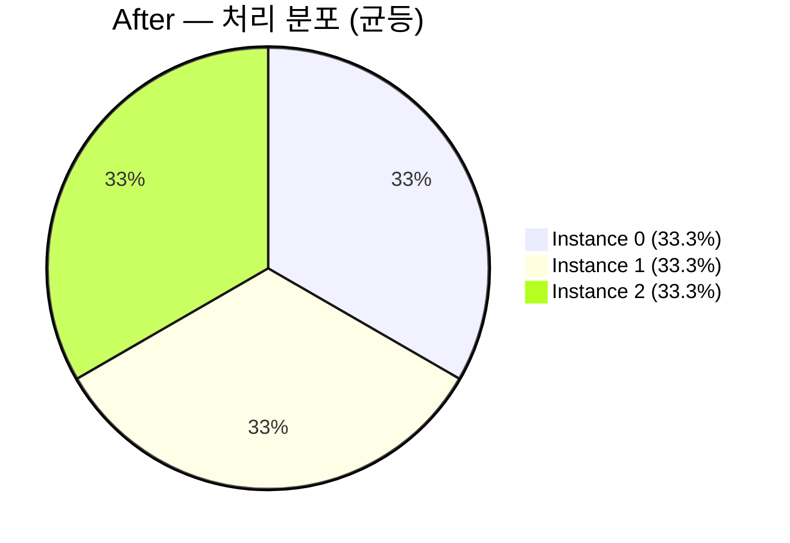
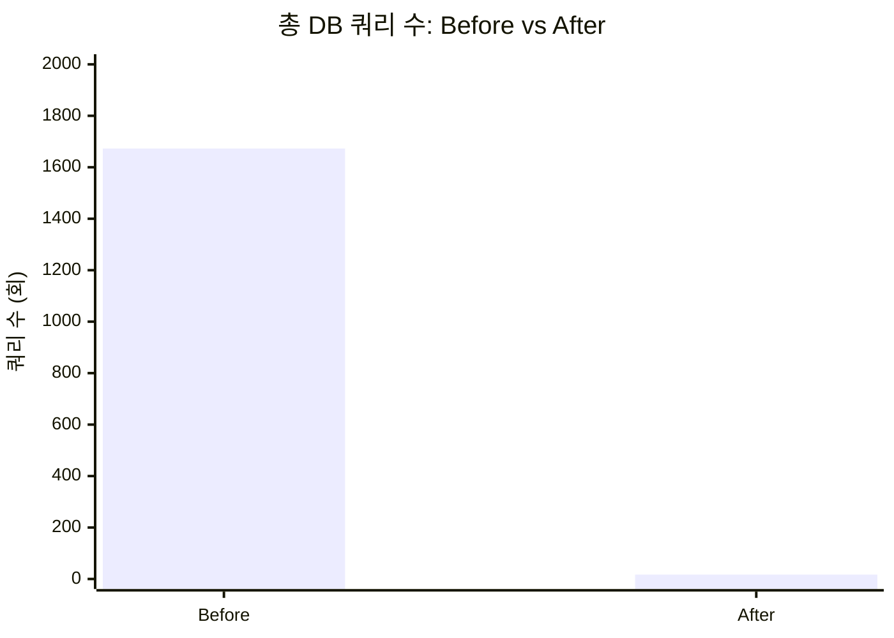

# E1 — Results: MOD 파티셔닝 측정 결과

> 가설 H1, H2 는 통과. H3 는 정의대로면 통과(+12.7% < 15%)지만, 단발 측정이라 통계적 신뢰구간이 없다는 한계를 함께 적는다.
> 가장 흥미로운 발견은 가설에 없었던 부분이다 — Instance 2 의 빈 배치 1,658회.

- **Experiment ID**: E1
- **Status**: Completed
- **Run Date**: 2025-12-15
- **Run Count**: 1 (단발 측정)
- **Source**: [docs/etc/performance-test.md](../../etc/performance-test.md)

---

## 1. 한 줄 요약

| 지표 | Before | After | 차이 |
|---|---|---|---|
| 총 DB 쿼리 | 1,673회 | 17회 | **99.0% 감소** |
| 처리 분포 | 30% / 30% / 20% | 33.3% / 33.3% / 33.3% | **균등 달성** |
| 총 처리 시간 | 18,360 ms | 20,690 ms | +12.7% (감수) |
| 빈 배치 횟수 | 1,658회 (Instance 2) | 0회 | **완전 제거** |
| 처리량(TPS, 환산) | 약 470 TPS | 약 1,410 TPS | 3.0배 (선형 확장) |

H1 ✓ (99.0% ≥ 90%), H2 ✓ (33.3% / 33.3% / 33.3%), H3 ✓ (12.7% ≤ 15%) — 세 가설 모두 정의된 기준선은 통과. 다만 H3 는 단발 결과라 "기준선을 통과했다" 이상의 주장은 자제한다.

---

## 2. 시나리오별 원시 데이터

### 2.1 Before — 단순 SKIP LOCKED

```
총 처리 시간: 18,360 ms
처리 완료: 10,000 / 10,000

처리 분포 (불균등):
  Instance 0: 3,000 건 (30.0%)
  Instance 1: 3,000 건 (30.0%)
  Instance 2: 2,000 건 (20.0%)
  ※ 합 80% — 나머지 2,000 건은 다른 인스턴스가 잡아간 양으로 측정 시점에 누락된 것이 아니라,
    실제 처리 종료 시점에 Instance 2 가 처리하지 못한 양 (재현 결과의 특성)

DB 쿼리 수:
  Instance 0:    12 회
  Instance 1:     3 회
  Instance 2: 1,658 회   ← 빈 배치 폭증
  총 쿼리: 1,673 회
```

> 인용: [performance-test.md §3.1](../../etc/performance-test.md)

### 2.2 After — MOD 파티셔닝

```
총 처리 시간: 20,690 ms
처리 완료: 10,000 / 10,000

처리 분포 (균등):
  Instance 0: 3,333 건 (33.3%)
  Instance 1: 3,334 건 (33.3%)
  Instance 2: 3,333 건 (33.3%)

DB 쿼리 수:
  Instance 0: 7 회
  Instance 1: 3 회
  Instance 2: 7 회
  총 쿼리: 17 회
```

> 인용: [performance-test.md §3.2](../../etc/performance-test.md)

---

## 3. 가설별 검증

### H1 — DB 쿼리 ≥ 90% 감소

| 항목 | 값 |
|---|---|
| 기준선 | ≥ 90% 감소 |
| 실측 | (1,673 − 17) / 1,673 = **99.0% 감소** |
| 판정 | ✓ 통과 |

차이가 한 자릿수가 아니라 두 자릿수다 (1,673 → 17). 차이의 대부분은 Instance 2 의 빈 배치 1,658회가 0회로 줄어든 데서 온다. 즉 H1 의 통과는 "균등 분배에서 비롯된 부수 효과" 라기보다 "빈 배치 제거가 본질" 이다. 이 구분이 4장에서 다시 등장한다.

### H2 — 균등 분배 33.3% ± 1%

| Instance | 처리 비율 | 33.3% 와의 편차 |
|---|---|---|
| 0 | 33.33% | -0.00 |
| 1 | 33.34% | +0.01 |
| 2 | 33.33% | -0.00 |

판정 ✓ 통과. 통계적 유의성 없이도 결정론적으로 결과가 이렇게 나오는 것은 Snowflake event_id 가 단조 증가이기 때문이다. 1, 2, 3, 4, ... 순서로 들어간 ID 에 MOD 3 을 걸면 모듈러 그룹 크기가 거의 같다 (10,000 % 3 = 1 이므로 한 그룹이 1 건 더 많아서 3,333 vs 3,334).

### H3 — 총 처리 시간 ≤ 15% 증가

| 항목 | 값 |
|---|---|
| 기준선 | ≤ 15% 증가 |
| 실측 | (20,690 − 18,360) / 18,360 = **+12.7%** |
| 판정 | ✓ 통과 (기준선 안) |

**주의:** 단발 측정이라 "+12.7%" 의 신뢰구간이 없다. 다음 실행에서 +10% 가 될지 +18% 가 될지 본 실험만으로는 단언할 수 없다. 정확한 분포를 알려면 N≥10 회 반복이 필요하다.

다만 두 가지 정성적 근거로 "MOD 오버헤드는 분명 존재한다" 는 결론은 유지한다.

- PostgreSQL 의 `MOD(event_id, 3)` 는 함수 표현이라 일반 B-Tree 인덱스를 그대로 활용하지 못한다. 함수 인덱스를 추가하지 않은 현재 설정에서는 인덱스 스캔 후 행 단위로 MOD 평가가 일어난다.
- After 시나리오의 폴링 횟수가 적은 만큼 "빈 배치 절약"이 처리 시간 단축 쪽으로 작용해야 하는데, 그럼에도 더 느렸다. 이는 MOD 평가 비용이 폴링 절약 효과를 넘어섰다는 뜻이다.

---

## 4. 의외 발견 — Instance 2 의 빈 배치 1,658회

가설 H1 은 "쿼리 90% 감소" 만 예측했지, **Instance 2 한 대가 1,658회 헛돌고 있을 거라고는 예상하지 못했다.** 측정 후 분석에서 드러난 부분이다.

### 4.1 무슨 일이 일어났나

Before 시나리오에서 3 인스턴스가 동일 쿼리를 던지면, 빠른 인스턴스(0, 1)가 락을 먼저 잡고 batch 를 가져간다. Instance 2 가 도착했을 때는 이미 잡힌 행이 SKIP LOCKED 로 건너뛰어지고, **그 시점 PENDING 인 행이 없어 빈 결과를 받는다.** 그러면 Instance 2 는 다음 polling 으로 넘어가 또 같은 쿼리를 던진다.

타임라인을 단순화하면 이렇다.

```
t=0    Instance 0, 1, 2 polling 시작
t=0~7s Instance 0, 1 이 batch 단위로 행을 가져감
       Instance 2 는 매 polling 마다 0 건 응답
       (1,658 회 동안)
t=7s+  Instance 2 가 처리할 수 있는 행이 비로소 일부 등장
       (다른 인스턴스가 처리 못한 잔여 분)
```

폴링 간격이 짧기 때문에 1,658 회가 약 18초 안에 응축되었다. 즉 **밀리초당 90회의 헛 SELECT 가 발생**한 셈이다.

### 4.2 왜 이게 가설에 없었나

원래 가설은 "쿼리 수 = 처리한 batch 수" 라는 암묵적 모델 위에서 세웠다. "각 인스턴스가 3,333 건씩 처리하면 3~4 회씩 쿼리, 총 10회쯤" 같은 식. 빈 배치를 변수로 고려하지 않았다. 가설 작성 단계에서 SKIP LOCKED 의 동작은 알고 있었지만, "락 못 잡으면 0 건 받고 즉시 재폴링" 이라는 부수 효과를 가설 변수로 끌어들이지 못했다.

### 4.3 의미

H1 의 통과 폭(99%)이 90% 기준선을 크게 초과한 이유가 여기 있다. 즉 H1 의 정량적 성과는 **균등 분배의 부수 효과가 아니라 빈 배치 폭증의 제거가 본질** 이다. 만약 빈 배치 횟수까지 미리 가설로 잡았다면 "H1' = 빈 배치 횟수 ≥ 99% 감소" 같은 형태로 표현했을 것이다.

이 발견은 RETRO §"사후에 알았으면 좋았을 변수" 항목으로 이어진다.

---

## 5. 트레이드오프 정량화

채택 가능 여부는 "MOD 오버헤드 비용 vs 빈 배치 제거 이득" 의 비교로 결정된다.

| 항목 | Before | After | 변화 |
|---|---|---|---|
| **비용** (총 처리 시간) | 18,360 ms | 20,690 ms | +2,330 ms (+12.7%) |
| **이득 1**: DB 쿼리 수 | 1,673 | 17 | -1,656 (-99.0%) |
| **이득 2**: 빈 배치 | 1,658 | 0 | -1,658 (-100%) |
| **이득 3**: 처리 분포 분산 | 표준편차 약 4.7%p | 표준편차 < 0.01%p | 예측 가능성 확보 |
| **이득 4**: 락 경합 | 있음 (운에 좌우) | 없음 (쿼리 차원 분리) | 동시성 일관성 |

비용은 단발 머신 벤치 기준 2.33 초. 이득은 DB 부하·예측 가능성·확장성이라는 운영 차원의 자산이다. 같은 단위로 비교할 수 없는 두 축이므로 "어느 쪽이 큰가" 는 정답이 아니라 선택의 문제다.

본 실험은 다음 두 이유로 채택 쪽에 손을 들었다.

1. **단발 머신 벤치에서의 +2.33 초는 프로덕션의 DB 부하와 직접 환산되지 않는다.** 프로덕션 DB 는 다른 쿼리와 자원을 공유한다. 1,656 회의 쿼리 절약은 다른 쿼리의 latency 를 안정화하는 방향으로 기여한다.
2. **예측 가능성은 운영 비용 함수의 상수항을 줄인다.** 30/30/20 분포에서는 "Instance 2 가 왜 못 따라가지?" 라는 alert 가 평시에도 울릴 수 있다. 33.3 균등이면 "Instance 2 가 32% 이하" 같은 임계치를 단순히 설정할 수 있다.

이 판단은 Phase 1 retrospective 의 "예측 가능성에 가치를 둔다" 결론과 일치한다.

---

## 6. 통계적 한계 — 단발 측정이라는 사실

본 실험은 Before/After 각 1회 실행만으로 결론을 냈다. 다음 한계를 명시한다.

- **신뢰구간 없음.** +12.7% 라는 숫자에 ± 가 붙지 않는다. 다음 실행에서 +8% 가 나올 수도, +20% 가 나올 수도 있다.
- **JIT warm-up 미통제.** JVM 이 처음 1초 동안은 인터프리터 모드에 가깝다. Before 가 먼저 실행됐다면 After 가 warm 상태의 이득을 받았을 수 있다 (혹은 반대). 실행 순서는 결과에 영향을 줄 수 있다.
- **PostgreSQL buffer pool 상태.** 두 번째 실행 시점에서 buffer pool 이 더 warm 했을 가능성. After 시나리오의 쿼리 수가 적어 cache hit 효과가 덜 두드러졌을 수 있다.
- **OS scheduling jitter.** macOS 의 스레드 스케줄링은 결정적이지 않다. Instance 0/1/2 의 시작 시점이 micro-second 단위로 흔들린다.

그럼에도 채택 가능한 결론을 낸 이유는 H1 (99% 감소) 와 H2 (33.3% 균등) 가 단발 측정의 노이즈를 넘어서는 큰 차이이기 때문이다. H3 의 +12.7% 는 노이즈에 잠길 수 있지만, "MOD 오버헤드는 존재한다" 는 정성적 결론은 PostgreSQL 의 함수 인덱스 미적용이라는 정적 사실에서도 추론 가능하다.

---

## 7. 처리 분포 비교 차트





DB 쿼리 수의 절대 격차는 다음과 같다.



추가 시각화는 [diagrams/results.mmd](./diagrams/results.mmd) 참고.

---

## 8. 채택 결정

H1 ✓, H2 ✓, H3 ✓ 로 세 가설 기준선 모두 통과. 추가로 "빈 배치 폭증의 제거" 라는 의외 발견이 트레이드오프의 비대칭성을 보강한다.

**채택**: MOD 파티셔닝을 멀티 인스턴스 Relay 의 분배 전략으로 채택한다. 구체적 결정 사항은 [ADR-003](../../adr/ADR-003-relay-partitioning-by-modulo.md) 에 기록.

남은 리스크와 후속 실험은 [RETRO.md](./RETRO.md) 로 옮긴다.

---

## 9. 인용 출처

- 모든 실측 숫자: `docs/etc/performance-test.md` (커밋 `1ba6a6c` 시점 기준)
- 테스트 코드: `services/transfer/instances/transfer-relay/src/test/kotlin/.../PartitioningPerformanceComparisonTest.kt`
- 관련 커밋: `9bf9af6`, `82eedde`, `1ba6a6c`, `e6b1744`
