# E2 — 락 전략 회귀 실험: 실측 결과

> 측정 기간: 2025-11-22 ~ 2025-11-23. 실측 파일: `load-test/k6-output.log`, `load-test/k6-detailed.log`, `load-test/test-output.txt`.
> 실측 회차는 `simple-test.js` (VU=5, 10s) 한 종이다. ramp/hotspot/bidirectional은 미수행 — `RETRO.md` 참고.

---

## 1. 한 줄 요약

낙관락에서 비관락으로 전환하자 에러율이 80% → 18%로 떨어졌다. 그 대가로 평균 latency는 19ms → 37ms (+95%), p95는 40ms → 76ms (+90%)로 늘었다. 가설 H1·H2·H3 모두 통과. 단, H2는 경계에 가깝다.

---

## 2. 실측 데이터

### 2.1 기본 표

| 메트릭 | 낙관락 (k6-output.log) | 전환 과도기 (test-output.txt) | 비관락 (k6-detailed.log) | 낙관락 대비 변화 |
|---|---|---|---|---|
| 측정 시각 | 2025-11-22 19:28 | 2025-11-22 21:04 | 2025-11-23 03:01 | — |
| 시나리오 | simple-test.js | simple-test.js | simple-test.js | 동일 |
| VU | 5 | 5 | 5 | — |
| Duration | 10s | 10s | 10s | — |
| 총 요청 | 50 | 50 | 50 | — |
| 에러율 | **80.00%** | 38.00% | **18.00%** | **-62%p** |
| 성공 / 실패 | 10 / 40 | 31 / 19 | 41 / 9 | — |
| avg latency | **19.00 ms** | 37.23 ms | **37.07 ms** | **+95%** |
| median | 19.13 ms | 37.59 ms | 34.39 ms | +80% |
| p90 | 28.75 ms | 47.54 ms | 48.68 ms | +69% |
| p95 | **40.16 ms** | 50.31 ms | **75.96 ms** | **+90%** |
| max | 46.81 ms | 51.72 ms | 79.18 ms | +69% |
| min | 6.25 ms | 15.43 ms | 9.89 ms | — |
| http_reqs/s | 4.90 | 4.81 | 4.81 | -2% |

세 번째 칸(전환 과도기)은 일부 코드 경로가 낙관락을 유지한 채 비관락으로 부분 전환된 중간 상태다. 같은 시간대에 락 전략이 섞여 있어, 충돌은 줄었지만 latency는 비관락 수준으로 올라간 상태로 잡혔다.

### 2.2 에러 원인 분포

낙관락 시점의 실패 50건 중 관측된 에러 유형:

- `Row was updated or deleted by another transaction` — `AccountBalanceJpaEntity#20001` 대상 38건
- `duplicate key value violates unique constraint "transactions_pkey"` — 2건

후자는 락 전략과는 별개로 Snowflake ID 생성기가 같은 밀리초/같은 머신 ID에서 시퀀스를 겹쳐 발생한 케이스다. 락 실험의 변수가 아니므로 H1 판정에서 제외한다. 즉 락 관련 실패는 38/40 ≈ 95%.

### 2.3 비관락 잔여 에러 9건

비관락 회차의 실패 9건은 같은 시간대(03:01:40 ~ 03:01:49) 동안 균등 분포되어 발생했다. 본문은 모두 `Row was updated or deleted by another transaction`이었다. 이는 두 가지 가능성을 시사한다.

- (a) 일부 코드 경로(예: 이벤트 발행 후 후처리 update)가 여전히 낙관락 `@Version`을 사용한다.
- (b) `@Version` 컬럼이 엔티티에 남아 있어, Hibernate가 락 모드와 무관하게 버전 체크를 수행한다.

`AccountBalanceJpaEntity`의 `@Version` 컬럼은 비관락 전환 후에도 제거되지 않았다. (b)가 유력한 원인이다. 후속에서 컬럼 제거 또는 락 획득 경로 통일로 0%까지 줄일 수 있는지 확인한다.

---

## 3. 가설 검증

### 3.1 H1 — 에러율 ≥ 50%p 감소

| 항목 | 기준 | 실측 | 판정 |
|---|---|---|---|
| 에러율 감소폭 | ≥ 50%p | 62%p (80% → 18%) | **통과** |

낙관락 80% 에러율은 단순한 충돌이 아니라 도미노다. 한 트랜잭션이 `@Version`을 1 올리면, 그 시점에 이미 같은 row를 읽고 있던 다른 4개의 트랜잭션은 모두 stale이 된다. VU 5이면 각 트랜잭션이 평균 4개의 동시 트랜잭션과 경쟁한다. 즉 1번 성공할 때마다 그 시간 창에 진입한 4개가 실패하는 패턴이다. 80%는 이 도미노의 정상 결과값에 가깝다.

비관락으로 전환하면 그 시간 창이 락 대기로 흡수된다. 충돌은 사라지고 대기로 바뀐다. 18% 잔여는 위 2.3에서 다룬 별도 경로다.

### 3.2 H2 — Latency 증가 ≤ 100%

| 항목 | 기준 | 실측 | 판정 |
|---|---|---|---|
| avg 증가율 | ≤ 100% | +95% | **경계 통과** |
| p95 증가율 | ≤ 100% | +90% | **경계 통과** |
| p95 절대값 | ≤ 500ms | 76ms | 통과 |

기준선 안쪽이지만 여유는 크지 않다. VU 5에서 이미 +90%대다. VU가 10, 25, 50으로 늘면 락 대기는 선형 이상으로 증가할 가능성이 높다 — `ANALYSIS.md`의 "이론적 최악 대기 시간 = 락 유지 시간 × (동시 VU - 1)" 추정과 일치한다. 이 부분은 VU 증가 실험 없이 H2 통과를 확정해서는 안 된다.

### 3.3 H3 — 데드락 0건

`bidirectional-test.js`는 이번 회차에 실행되지 않았다. 다만 다음 두 근거로 H3는 잠정 통과로 본다.

- `TransactionService.loadUsers`가 계좌번호 오름차순으로 락을 잡는다 (`TransactionService.kt:82-86`).
- 비관락 회차의 50건 응답에서 `deadlock detected` 로그가 0건이었다.

확정 통과는 양방향 시나리오 실측 후로 미룬다.

---

## 4. 트레이드오프 정량화

| 비용 / 이득 | 수치 | 의미 |
|---|---|---|
| 비용 (latency) | avg +18ms, p95 +35.8ms | 단일 요청 기준 약 2배 |
| 이득 (에러율) | -62%p (80% → 18%) | 실패가 1/4 수준 |
| 이득 (재시도 부담) | 클라이언트 재시도 불필요 | 5xx → 200으로 흡수 |
| 비용 (DB 자원) | connection pool 점유 시간 증가 | 임계점 미측정 |

**해석.** "20ms 더 느려도 80%였던 에러율이 18%로 떨어진다"가 핵심이다. 송금 도메인에서 5xx는 클라이언트에게 그대로 노출된다. 사용자에게 "이체 실패했습니다"가 80% 떠 있는 상태와 "이체에 18ms 더 걸렸습니다"의 차이는 비교 대상이 아니다.

다만 이 결론은 **VU 5 기준**이라는 단서가 붙는다. 락 보유 시간 × (VU - 1)이 100ms를 넘는 순간 사용자 체감 latency로 들어온다. VU 100을 가정하면 이론적 최악 대기는 거의 5초다 — `ANALYSIS.md` §3 참고.

---

## 5. 예상치 못한 발견

### 5.1 낙관락 80% 에러율은 "재시도 누락"이 아니라 "구조적 도미노"

처음에는 "낙관락 + 재시도 1~3회"로 충분할 거라 봤다. 그런데 위 분석대로, 5 VU에서 평균 4명이 같은 row를 보고 있다. 재시도를 N번 두어도 N+1번째 사람이 또 같은 시간 창에 들어온다. 백오프를 매우 길게 잡거나(요청당 수백 ms), 큐로 직렬화하지 않는 한 재시도만으로는 안 빠진다. 결국 "재시도를 N회 하느니 처음부터 직렬화한다"가 비관락의 본질이다.

### 5.2 비관락 잔여 18%

위 2.3에서 다뤘다. `@Version` 컬럼이 남아 있으면 비관락이 잡혀 있어도 Hibernate가 flush 시점에 버전 비교를 한다. 락 모드만 바꿔서는 충돌 가능성이 완전히 사라지지 않는다는 점은 사전에 명시적으로 검증되지 않았다.

### 5.3 throughput은 거의 변하지 않았다

http_reqs/s는 4.90 → 4.81로 사실상 동일하다. 이것은 함정이다. VU가 5로 고정되어 있고 각 VU가 `sleep(1)`로 자기 페이스를 통제하기 때문이다. 즉 이 측정은 throughput을 못 본다. 본 실험은 "에러율과 latency"에만 의미가 있다. throughput 비교는 sleep 없는 시나리오에서 다시 측정해야 한다.

### 5.4 p95 절대값보다 분포가 의심스럽다

낙관락 회차에서 p95(40ms)와 max(47ms)가 가깝다. 비관락 회차에서는 p95(76ms)와 max(79ms)가 더 가깝다. 두 경우 모두 꼬리가 짧다. 의미: VU 5에서는 락 대기가 큐 꼬리를 만들 만큼 깊지 않다. VU를 늘렸을 때 꼬리가 어떻게 자라는지가 진짜 시험이다. 이번 측정은 그 꼬리를 못 봤다.

---

## 6. 시각화

### 6.1 핵심 지표 비교

```mermaid
xychart-beta
    title "락 전략별 핵심 지표 (VU=5, 10s)"
    x-axis ["에러율(%)", "avg(ms)", "p95(ms)"]
    y-axis "값" 0 --> 100
    bar "낙관락" [80, 19, 40]
    bar "비관락" [18, 37, 76]
```

### 6.2 시퀀스 비교

자세한 락 획득 흐름은 `diagrams/comparison.mmd` 참고. 요점만 정리하면:

- 낙관락: 모든 VU가 동시에 같은 row를 읽고, 가장 먼저 커밋한 한 명만 살아남는다. 나머지는 `StaleObjectStateException`.
- 비관락 + 정렬: 모든 VU가 같은 순서(`min(account)` → `max(account)`)로 락을 요청한다. 첫 번째 락을 잡지 못한 트랜잭션은 대기하고, 데드락은 발생하지 않는다.

---

## 7. "왜 단순 retry 횟수를 늘리는 게 답이 아닌가"

가장 자주 나오는 반론은 "낙관락 유지하고 재시도 회수만 늘리면 되지 않나"다. 이 실험의 데이터로 답을 정리한다.

### 7.1 산술적 비용

VU=5, 평균 트랜잭션 시간 ≈ 20ms. 매 시점에 동시 진행 중인 트랜잭션이 평균 4건. 그중 하나가 커밋하면 나머지 4건은 stale로 떨어진다. 1회 재시도 시 다시 4건이 경쟁한다. 재시도 N회 후 성공 확률은 대략 1 − (1 − 1/k)^N (k는 평균 동시 트랜잭션 수). VU 5에서는 N=3이면 약 58%, N=5면 약 70%. 즉 N을 늘려도 18%까지 떨어지지 않는다.

비관락 18%는 트랜잭션이 도착하자마자 큐에 줄을 서서 얻은 결과다. 같은 18%를 낙관락 + 재시도로 얻으려면 재시도가 매우 많이 필요하고, 매 재시도가 또 다른 트랜잭션의 충돌 원인이 된다 (retry storm).

### 7.2 부수 효과

- 재시도가 늘면 unique constraint 위반(snowflake duplicate 등)이 더 자주 노출된다. 실측에서 이미 2건 잡혔다.
- 재시도 동안 트랜잭션이 점유한 자원(커넥션, 캐시 lock 등)이 늘어난다.
- 클라이언트 입장에서 응답 시간 분포가 두 봉우리(성공/재시도성공)로 갈라진다 — 모니터링이 어려워진다.

### 7.3 결론

재시도는 비관락을 못 쓸 때의 차선이지, 비관락의 대안이 아니다. 재시도는 본질적으로 "운에 기대는 직렬화"이고, 비관락은 "DB에 줄을 세우는 직렬화"다. 도착하자마자 줄을 서는 쪽이 훨씬 예측 가능하다.

---

## 8. 한계 명시

이 결과는 다음 조건에서만 유효하다.

- 단일 머신, 단일 Transfer API 인스턴스
- VU 5, 10초 단발 측정
- 계좌 풀 20개, 랜덤 송금자/수신자 패턴
- Postgres `READ_COMMITTED`
- HikariCP maximumPoolSize=10

특히 VU 5에서 통과한 H2는 VU 50/100에서도 통과한다고 단정할 수 없다. 후속 실측이 필요하다.

---

## 9. 다음 문서

- `RETRO.md` — 이 실험에서 무엇을 과소평가했는지, 다음에 무엇을 측정할지.
- `DESIGN.md` — 실험 설계와 가설 정의.
