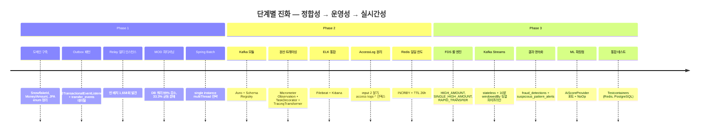

# Retrospective — 단계별 회고

> 각 phase 마다 무엇을 만들었고, 왜 그렇게 했고, **무엇이 잘못됐고**, 어떻게 고쳤나 정리.
> 자랑이 아니라 **학습 기록**이다.

## 회고 인덱스

| Phase | 주제 | 회고 |
|---|---|---|
| 1 | Outbox + 파티셔닝 (정합성) | [phase-1-outbox-and-partitioning.md](phase-1-outbox-and-partitioning.md) |
| 2 | 관측성과 캐시 (운영성) | [phase-2-observability-and-cache.md](phase-2-observability-and-cache.md) |
| 3 | 스트림 처리와 FDS (실시간성) | [phase-3-streaming-and-fds.md](phase-3-streaming-and-fds.md) |

## 프로젝트 타임라인

## 횡단 학습 (모든 phase 에 걸친 교훈)

### TODO 주석은 시한 폭탄

`TransferValidator` 의 일일 한도 검증이 **1개월간 주석 처리된 채** 방치되었다. 비즈니스 룰이 비활성화된 상태로 동작 중. 코드는 컴파일 통과, 테스트는 그 분기를 안 탐.

**교훈**: TODO 는 코드가 아니다 — **issue 트래커에 시한과 함께 등록**되어야 한다. 코드 안의 TODO 는 한 달 후 사라진다 / 영원히 남는다 둘 중 하나.

### NoOp 어댑터에는 만료일이 있어야 한다

`NoOpRecentTransferCountQueryAdapter`, `NoOpAiScoreProvider` 같은 어댑터는 "포트만 만들고 구현은 나중에" 의 합리적 패턴이다. 하지만 **만료 조건 없는 NoOp 는 영구 잔존**한다.

**교훈**: NoOp 어댑터의 commit 메시지에 issue 번호 + 만료일을 명시. 회고 시 NoOp 잔존을 확인.

### 흐름의 끝을 항상 확인

Kafka 토픽에 메시지를 발행하는 코드만 있고 **구독하는 컨슈머가 없다면 그 토픽은 garbage**. Phase 3 에서 `fds-analysis-results`, `suspicious-patterns` 토픽이 한동안 발행만 됨.

**교훈**: 시스템 다이어그램의 모든 화살표는 **출발지와 도착지**를 가져야 한다. "발행했다"는 작업의 절반.

### 인덱스/스키마/엔티티의 drift 는 자동화로 잡아야 한다

`FraudDetectionJpaEntity` 의 `@Column(name = "status")` vs DDL 의 `action_type` 컬럼. **컴파일은 통과하고 런타임 INSERT 실패** 하는 버그.

**교훈**: `spring.jpa.hibernate.ddl-auto=validate` 모드로 통합 테스트를 한 번이라도 돌렸어야 함. 후속 PR 작업.

### 관측성은 사후가 아니라 사전에

분산 트레이싱이 도입된 후에야 @Async traceId 손실, Kafka 컨슈머의 새 trace 시작 같은 **이미 존재했지만 보이지 않았던 결함들**이 드러났다.

**교훈**: 관측성 인프라가 우선이다. 사후에 도입하면 도입 비용 + 발견되지 않은 결함 디버깅 비용이 더해진다.

## 회고 작성 규칙

1. **자랑 금지** — 잘한 일은 짧게, 잘못한 일은 길게.
2. **수치 인용** — "성능 향상" 보다 "DB 쿼리 1,673회 → 17회 (99% 감소)".
3. **버린 옵션** — "검토했지만 안 한 것" 을 명시. 면접에서 가장 자주 묻는 부분.
4. **코드 인용** — `services/.../File.kt:LL` 형태로 위치 명시.
5. **Q&A 5개 이상** — 빅테크 면접에서 받을 법한 질문 + 정직한 답변.
6. **다음 회고에서 검증할 것** — 회고는 미래의 자신에게 보내는 문서.

## 관련 문서

- [ADR](../adr/README.md) — 결정의 단면도
- [DECISIONS-TIMELINE](../DECISIONS-TIMELINE.md) — 결정의 시간 축
- [LIMITATIONS](../LIMITATIONS.md) — 인정된 한계
- [부하 테스트 분석](../load-test/README.md) — 측정 근거
