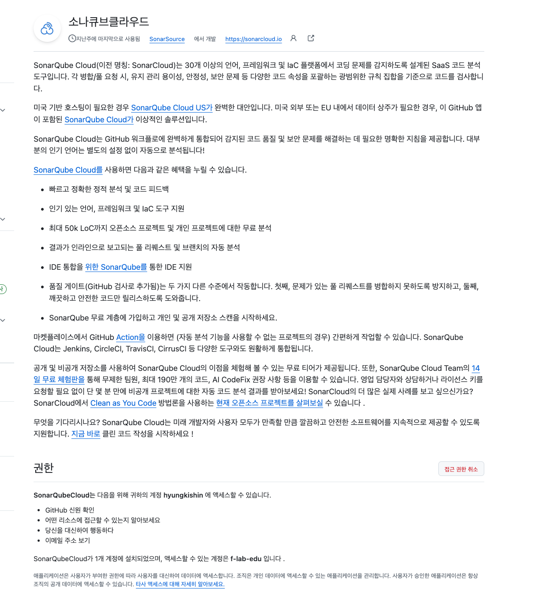

## sornar Qube 연동



코드 커버리지를 측정하는 Jacoco와는 달리 SonarQube 는 코드의 질을 측정하는 도구이다.
"얼마나 테스트했는가" 에 가까운 것은 Jacoco, "코드가 건강한가?" 를 측정하는 쪽은 SonarQube 라고 보면 된다.

## 어떤 걸 분석하나 ?
SonarQube 는 코드를 Scan 해서 다음과 같은 부분을 자동으로 체크해준다.  

- Bug: 확정은 아니지만 왠지 오류 날 것 같은 코드
- Code Smell: 미래 퇴사 플래그 같은 구조적 문제 경고
- Security Hotspot: 보안 취약 가능성 있는 위치
- Duplications: 중복 코드
- Coverage: 테스트 커버리지 (Jacoco 연동 시 자동 포함)

## 오 과연...사람 냄새 나는 리뷰와 어떤 차이가 있을까?
사람 리뷰는 주관적이고, 경험에 따라 다를 수 있고, “이해”하는 데에 강하다.   
SonarQube 는 코드에서 “패턴”을 읽는 데에 강하다고 한다.  

> 올 ... point 가 명확했다.  
> 코드 줄 수가 많아질수록, 리뷰가 귀찮아질수록, 오히려 정적 분석기가 더 *열일한다* 고 할 수 있겠다.

Jacoco 의 커버리지 는 테스트의 양을 보여주고,   
SonarQube 는 코드의 질을 보여준다.

## github actions 연동
```yml
name: SonarQube Analysis

# main 브랜치로의 Pull Request 발생 시 워크플로 트리거
on:
  pull_request:
    branches: [main]

jobs:
  sonar:
    runs-on: ubuntu-latest

    steps:
      # 1. GitHub 저장소의 소스 코드를 체크아웃
      - name: Checkout
        uses: actions/checkout@v4

      # 2. Gradle 관련 캐시 복원 (의존성 재다운로드 방지, 빌드 속도 향상)
      - name: Cache Gradle
        uses: actions/cache@v4
        with:
          path: |
            ~/.gradle/caches
            ~/.gradle/wrapper
          key: gradle-${{ runner.os }}-${{ hashFiles('**/*.gradle*', '**/gradle-wrapper.properties') }}
          restore-keys: gradle-${{ runner.os }}-

      # 3. SonarQube 분석 도구 관련 캐시 복원 (~/.sonar/cache)
      #    분석 룰셋, 언어 지원 파일 등을 다시 다운로드하지 않도록 캐시 활용
      - name: Cache SonarCloud scanner
        uses: actions/cache@v4
        with:
          path: ~/.sonar/cache
          key: sonar-${{ runner.os }}

      # 4. JDK 21 설치 (Temurin: 안정성과 라이선스 측면에서 널리 사용되는 OpenJDK 배포판)
      - name: Set up JDK 21
        uses: actions/setup-java@v4
        with:
          distribution: 'temurin'
          java-version: '21'

      # 5. Gradle Wrapper 실행을 위한 권한 부여 (Linux 환경에서 필수)
      - name: Grant execute permission
        run: chmod +x ./gradlew

      # 6. SonarQube 정적 분석 실행
      #    - 분석 결과는 SonarCloud에 전송되어 PR 품질 게이트 등과 연동됨
      #    - 환경변수로 SONAR_TOKEN을 사용하여 인증 처리
      - name: Run SonarQube analysis
        run: ./gradlew sonarqube --no-daemon
        env:
          SONAR_TOKEN: ${{ secrets.SONAR_TOKEN }}
```

## PR에서만 SonarQube 분석을 하도록 설정
처음에는 push, pull_request 둘 다 걸어놨다.  
근데 생각해보면 굳이 push 시점마다 돌릴 이유가 없다.  

SonarQube는 코드 변화에 대한 품질 이슈를 비교/분석하는 용도에 더 적합하고,  

PR 기준으로만 실행해도 중복 없이, 정확하게 품질 체크 가능하다.  

push마다 분석 돌리면 시간 낭비고, Actions 자원도 낭비된다.  
PR에서만 돌리면 딱 필요한 순간에만 분석하게 된다.  

## 캐시 적용
SonarQube가 느린 건 맞다.  
Gradle도 느리고, Sonar도 느리다. 근데 매번 다 새로 돌릴 필요는 없다.  

- ~/.gradle 캐시: 의존성 다시 받지 말도록!
- ~/.sonar/cache: 룰셋/스캐너 재다운로드 하지말도록!  

이 두 개만 캐싱해도 체감 시간은 확 줄어든다.  
정적 분석은 무겁지만, 캐시만 잘 걸면 충분히 빠르게 돌릴 수 있다.  

## 구조 설계
- jacoco-coverage.yml: 테스트 + 커버리지 리포트만 따로 실행
- sonarqube-analysis.yml: PR에서만 SonarQube 실행

> 커버리지는 항상 체크되도록 유지하고, Sonar는 PR에서 최종 확인용으로만 수행하도록 분리.  
> 워크플로는 용도 나눠서 관리하는 게 유지보수나 실행 시간 측면에서 훨씬 낫다.  