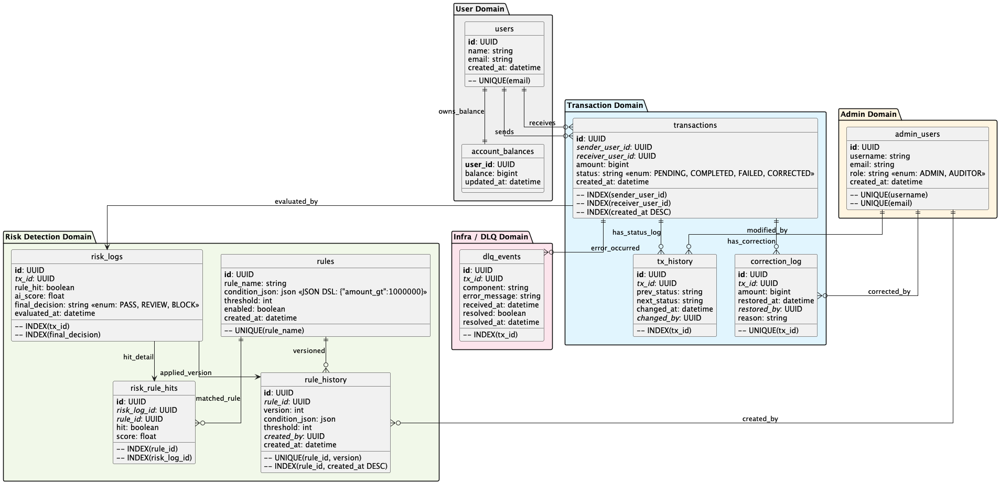

# ERD 설명


## User Domain – 사용자의 계정 정보와 자산 상태

| 테이블                         | 설명                                                                                  |
|-----------------------------|-------------------------------------------------------------------------------------|
| `users`         | **시스템 내 사용자 식별 정보.** <br/> unique 필드는 `이메일` 이며, `id`는 PK로 모든 트랜잭션과 연계된다. |
| `account_balances` | **사용자 자산 보유 상태.**  <br/> 외부 송금/입금 트랜잭션 시 사용되고, 실시간 잔액을 반영한다           |

관계
- users <-> account_balances: 1:1 매핑으로 유저의 현재 자산 상태 추적
- users <-> transactions: sender_user_id / receiver_user_id로 트랜잭션 주체

## Transaction Domain – 송금 흐름 및 상태 변경 기록
| 테이블              | 설명                                                               |
| ---------------- | ---------------------------------------------------------------- |
| `transactions`   | **송금 요청 정보.**<br/>송신자/수신자, 금액, 상태(`PENDING`, `COMPLETED`, 등)를 포함 |
| `tx_history`     | **트랜잭션 상태 변경 이력.**<br/>예: `PENDING → COMPLETED`로의 상태 변화를 기록      |
| `correction_log` | **이상 트랜잭션의 수정 이력.**<br/>금액 재조정 등 수동 조치 기록. 관리자 개입 포함             |

관계
- transactions -> tx_history: 트랜잭션의 상태 변경 로그
- transactions -> correction_log: 수동 수정 발생 시 기록
- admin_users -> tx_history, correction_log: 변경자/수정자 추적을 위한 FK 포함

### 상태흐름
> [PENDING] -> [RISK_EVALUATION] -> [REVIEW | PASS | BLOCK] -> [COMPLETED or CORRECTED]

## Risk Detection Domain – 이상 거래 탐지 및 룰 관리

| 테이블              | 설명                                                                                |
| ---------------- | --------------------------------------------------------------------------------- |
| `risk_logs`      | **트랜잭션에 대한 위험 탐지 결과.**<br/>룰 히트 여부, AI 점수(`ai_score`), 최종 판단(`final_decision`) 포함 |
| `risk_rule_hits` | **각 룰에 대한 hit 여부 및 점수.**<br/>어떤 룰이 발동되었는지 상세 기록                                   |
| `rules`          | **탐지 룰 정의.**<br/>JSON DSL 형식 조건(`condition_json`)과 threshold 기반 평가                |
| `rule_history`   | **룰 변경 이력.**<br/>버전 관리 및 rollback 가능. 생성자(admin) 정보 포함                            |

관계
- transactions -> risk_logs: 거래 평가 후 위험 로그 생성
- risk_logs -> risk_rule_hits: 룰별 평가 결과 기록
- rules -> risk_rule_hits: 어떤 룰이 발동되었는지 연결
- rules -> rule_history: 룰 변경 이력 저장
- admin_users -> rule_history: 룰 생성자/수정자 정보 추적

## Admin Domain – 관리자 및 운영 감사
| 테이블           | 설명                                                              |
| ------------- | --------------------------------------------------------------- |
| `admin_users` | **운영 관리자 및 감사자 계정.**<br/>역할(`role`)은 `ADMIN`, `AUDITOR` 등으로 구분됨 |

관계
- admin_users -> tx_history: 트랜잭션 상태 변경 주체
- admin_users -> correction_log: 수동 정정 조치 수행자
- admin_users -> rule_history: 룰 생성 및 변경 주체

## Infra / DLQ Domain – 장애 및 실패 이벤트 기록

| 테이블          | 설명                                                         |
| ------------ | ---------------------------------------------------------- |
| `dlq_events` | **Kafka 등 비동기 시스템에서의 처리 실패 로그.**<br/>컴포넌트/에러 메시지/재시도 여부 포함 |

관계
- transactions -> dlq_events: 트랜잭션 처리 중 장애 발생 시 DLQ 기록

## 전체 흐름
```text
users
  ├──> transactions
         ├──> risk_logs ──> risk_rule_hits
         │                   └──> rules ──> rule_history
         ├──> tx_history
         ├──> correction_log
         └──> dlq_events
```

---

# FDS 시스템 ERD 기반 시나리오 흐름 정리

---

## 회원가입 후 잔액 테이블 초기화

### 배경
신규 사용자가 시스템에 가입하면 계정이 생성되고, 초기 잔액이 세팅된다.

### 시나리오
1. 사용자가 회원가입을 완료함
2. 사용자 정보가 `users`에 저장됨
3. 회원가입 이벤트를 처리하는 서비스가 `account_balances`에 잔액 을 0 원으로 초기화

### 흐름 요약
```
회원가입 -> users 저장 -> account_balances 초기화
```

### 적재 테이블
| 테이블 | 내용 |
|--------|------|
| `users` | 사용자 기본 정보 (`id`, `email`, `name`, `created_at`) |
| `account_balances` | 사용자 ID 기반 초기 잔액 0 기록 |

### 연관 테이블
- `users.id` = `account_balances.user_id` (1:1 관계)

---

## 송금 요청 발생
사용자 A가 사용자 B에게 송금을 요청한다.

### 시나리오
B 친구에게 5만 원을 송금하려고 한다. 이 요청은 `transactions`에 저장되고, `status = PENDING` 상태로 시작한다.

### 흐름 요약
```
송금 요청 -> transactions(PENDING)
```

### 적재 테이블
| 테이블 | 내용 |
|--------|------|
| `transactions` | `sender_user_id = A`, `receiver_user_id = B`, `amount = 50000`, `status = PENDING` |

### 연관 테이블
- `users.id` = `transactions.sender_user_id`
- `users.id` = `transactions.receiver_user_id`

---

## 이상 거래 탐지 (FDS 평가)
모든 송금 요청은 FDS 룰 기반 혹은 AI 모델 기반으로 평가된다.

### 시나리오
사용자의 송금이 1,000,000원을 넘는 금액이라 FDS 룰 조건에 매칭되었다.  
-> 평가 결과는 `risk_logs`에 저장되고  
-> 어떤 룰이 hit 되었는지는 `risk_rule_hits`에 기록됨  
-> 최종 판단(`BLOCK`)으로 이어질 수도 있음

### 흐름 요약
```
transactions -> risk_logs -> risk_rule_hits -> final_decision 저장
```

### 적재 테이블
| 테이블 | 내용 |
|--------|------|
| `risk_logs` | `tx_id`, `ai_score`, `rule_hit = true`, `final_decision = BLOCK` |
| `risk_rule_hits` | `rule_id`, `score`, `hit = true` (복수 row) |

### 연관 테이블
- `transactions.id` = `risk_logs.tx_id`
- `risk_logs.id` = `risk_rule_hits.risk_log_id`
- `rules.id` = `risk_rule_hits.rule_id`

---

## 상태 변경 기록
송금 요청은 상태 변화가 많다. 예를 들어 `PENDING -> COMPLETED` 또는 `BLOCKED`.

### 시나리오
형기의 송금이 BLOCK 판단을 받아 상태가 바뀌었다. 이 변경은 감사 용도로 `tx_history`에 저장된다.

### 흐름 요약
```
transactions 상태 변화 → tx_history 기록
```

### 적재 테이블
| 테이블 | 내용 |
|--------|------|
| `tx_history` | `tx_id`, `prev_status = PENDING`, `next_status = BLOCKED`, `changed_by = system/admin` |

### 연관 테이블
- `transactions.id` = `tx_history.tx_id`
- `admin_users.id` = `tx_history.changed_by`

---

## 관리자 수동 정정 (Correction)
탐지 시스템이 잘못 판단해서 금액을 수정하거나 복구해야 하는 상황이 생긴다.

### 시나리오
관리자가 차단된 송금 요청을 수동으로 수정해서 3만 원만 처리되도록 조정한다.

### 흐름 요약
```
BLOCK 상태 → correction_log 기록
```

### 적재 테이블
| 테이블 | 내용 |
|--------|------|
| `correction_log` | `tx_id`, `amount = 30000`, `reason = '부분 승인'`, `restored_by = admin_id` |

### 연관 테이블
- `transactions.id` = `correction_log.tx_id`
- `admin_users.id` = `correction_log.restored_by`

---

## 시스템 장애로 DLQ 적재
FDS 처리 중 Kafka consumer 장애 등으로 이벤트 처리가 실패하면 DLQ에 저장된다.

### 시나리오
사용자의 송금이 평가 중 시스템 오류로 실패했다. 이때 에러 메시지와 함께 DLQ에 적재된다.

### 흐름 요약
```
FDS 처리 실패 → dlq_events 기록
```

### 적재 테이블
| 테이블 | 내용 |
|--------|------|
| `dlq_events` | `tx_id`, `component = risk-evaluator`, `error_message = 'timeout'`, `resolved = false` |

### 연관 테이블
- `transactions.id` = `dlq_events.tx_id`